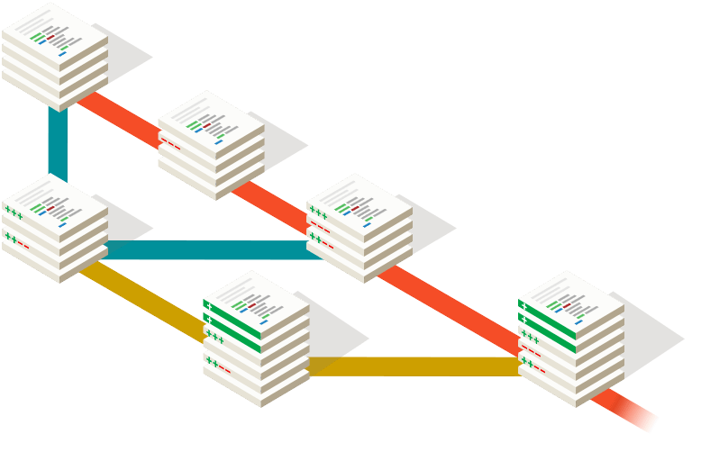

You are developing some feature together with your team. Most likely you have done the usual dance: checkout a branch from the master or development branch, done your commits, pushed this feature branch to the remote and opened a push request for peer review.

In ideal cases, you will be able to just squash and merge after some reviews and fixes. But, the world is not ideal (as you might know), and maybe one of your mates modified the same files and already merged it. So, surprise surprise, you got a merge conflict to resolve!

This usually means you will need to do a *git rebase* before merging. After doing it, this new rebased branch need to be pushed back to the remote. And here is one of the steps that people usually do wrong:

```sh
git push —-force
```

You might be thinking: what is the problem with this?

Well, **push force** ignore everything on the remote and override it with local changes. This is "kinda" what you want, but what if you did some mistake in the rebase but didn't notice? Or someone pushed more modifications while you were rebasing? Yes, you thought right: kaputt, gone. One safer way to do this is using:

```sh
git push --force-with-lease
```

This simple command will not push force your modifications until it checked if everything that is in the remote is also in your rebased version. It is the same as a *push force*, but safer.

If you want to know more about it, checkout [this article](https://developer.atlassian.com/blog/2015/04/force-with-lease/). But the basic idea is: **start to use *force-with-lease* instead of *force***.
