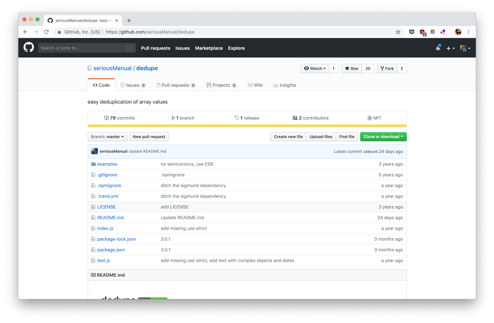
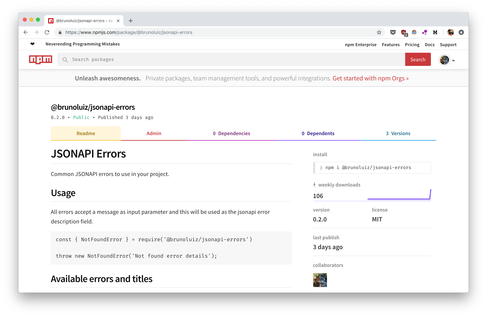

If you are not new in the JavaScript world, you might have already heard about [npm](https://www.npmjs.com/). It is a package manager which lets developers easily add dependencies to projects, as `npm install hello-world`. But, have you ever asked, "How do I create and publish my own packages"?

## How a package is composed?

Packages are quite simple to create in JavaScript. A `package.json` and `index.js` can already do the job. Look at `dedupe` for example:



There are other useful files such as `.gitignore`, `.npmignore`, `LICENSE` and `README.md`, but the main ones are there: `package.json` and `index.js`.  Having these, the package just needs to be published in a repository, such as the [npm public](https://www.npmjs.com/). Through this guide, you will be able to have a simple package published on npm.

## Create an npm package

While doing [apimock.in](https://apimock.in), I had to create multiple serverless stacks. Each had error handlers and, as most of the errors are quite the same, a good practice would be to extract these definitions into a package and just install it on each serverless stack. This use case will be used as an example through this post.

### Create an npmjs.com account

Before doing anything, an account on [npmjs.com](https://npmjs.com) is required for publishing a package. This is the website for the npm public repository, used when `npm install ...` is executed.

To create an account, go to the [npm signup page](https://www.npmjs.com/signup) and fill up the form. After finishing the process, a test can be done using `npm login` and `npm whoami`. Has it output your username? Great! It is working!

<!--  -->

### Some words about scopes

Scopes are useful in many ways, although not strictly required to publish an npm package. Every user has its own scope, defined as the npm user name.

As only the developer/company can publish to its own scope, it is quite useful to indicate it is an official package. For example, one can publish a package called `xyz-sdk`, but another called `xyz` might already exist. How to know which to install? What if `xyz` mimics `xyz-sdk`, but with malicious code?

> Each npm user/organisation has their own scope, and only you can add packages in your scope. This means you don’t have to worry about someone taking your package name ahead of you. Thus it is also a good way to signal official packages for organisations. ([from npm-scopes documentation](https://docs.npmjs.com/misc/scope))

A scoped package would have an `@account` prefix. It would be published as `@account/xyz-sdk`, hence easily identifiable as from a specific developer. Besides, the developer doesn't have to worry about name clashing, as the scope is account specific. It can be configured to point to a private repository as well, making it especially useful for companies.

There is [more information about scopes here](https://docs.npmjs.com/misc/scope). Keep in mind it is a good practice to scope packages.

### Create a simple structure

In an empty folder, run `npm init —-scope=@your-npm-user`. This will setup a `package.json` and ask for some information, such as name, version, main entry file and author. The end result will be something like the following.

```json
{
  "name": "@brunoluiz/jsonapi-errors",
  "version": "1.0.0",
  "description": "JSONAPI Common Errors",
  "main": "index.js",
  "scripts": {
    "test": "jest"
  },
  "author": "Bruno Luiz da Silva <contact@brunoluiz.net> (http://brunoluiz.net/)",
  "license": "MIT"
}
```

After having it initialised, is time to code something. Develop a basic implementation of it in the specified main file on `npm init` setup (usually `index.js`). If the package requires dependencies or there are files to be ignored on publishing, specify it on a `.gitignore` file (eg: `node_modules`).

It is suggested to add a `LICENSE.md` and a `README.md`, as other developers might use this package. Usually, MIT or ISC licenses are fine to open-source projects, but [choosealicense.com](https://choosealicense.com/) can help on choosing another license.

### Publish the package

The basic implementation is done and now is time to deploy it! On the first time, a `npm publish --access=public` is required. The `access=public` param is needed because scoped are `restricted` by default. On following publishings, a `npm publish` will do the job.

Congratulations! You published your first package on npm. It should be available at `https://npmjs.com/package/@your-npm-user/package-name` and ready to be installed through `npm install @your-npm-user/package-name`.

<!--  -->



### Releasing new versions

After some iterations, the package might need new features and, therefore a new version. NPM packages use semantic versioning ([SEMVER](https://semver.org/)), but in a nutshell:

> MAJOR version when you make incompatible API changes,
>
> MINOR version when you add functionality in a backwards-compatible manner, and
>
> PATCH version when you make backwards-compatible bug fixes.

In the `jsonapi-errors` example, a minor version increment is required. To do this, a `npm version minor` can be used, where it will bump the `package.json` version and add a tagged git commit. Then, a `npm publish` will take care of pushing it (no need for `access` parameter now). The version tags can be checked using `git log --decorate --oneline`.

```bash
b874866 (HEAD -> master, tag: v0.2.0) 0.2.0
c5af2df chore: add new implementations
b8571cc (tag: v0.1.0) 0.1.0
c5bf2ef chore: initial commit
```

There are [more information about the versioning process here](https://docs.npmjs.com/cli/version.html).

<!--  -->

### Using in local projects through linking

A simple way to test the new shiny package is through `npm install`. It will work as expected but, if a change is required, a new version has to be published and the project dependency has to be upgraded to use the new one.

This is unproductive, especially when a package is new and changes happen quite often. A way to solve it is through `npm link`: it creates a symbolic link inside the project `node_modules` folder, replacing the installed version with the local one.

In the module folder, run `npm link`, which will enable a global link for it. On the project folder, run `npm link <name>`. If the module is modified, projects using it through a link will have the latest version of it.

After testing, two steps are required to remove it. The first is running `npm unlink --no-save <name>`, which removes the link from the project without touching `package.json`. The second is `npm install`, as the module is removed from `node_modules` after unlinking.

Removing the global link is not required, especially because it can be used later. If still needed, a `npm unlink` in the module folder will do it.

## Automate publishing process using CircleCI

If a package has many people collaborating to it, or the deploy process requires extra steps beside publishing it, an automated setup can improve the workflow. There are plenty of options, such as CircleCI, Travis and GitLab CI.

On CircleCI Blog there is an [article explaining in details how to do it](https://circleci.com/blog/publishing-npm-packages-using-circleci-2-0/), where:

1. On feature branches, it will just run tests (eg: run tests on pull requests)
1. On git `v*.*.*` tag pushes, it will run tests and then publish to the NPM repository  —  remembering, a git version tag is generated by `npm version` 

More configurations can be added, such as saving coverage reports to a bucket or triggering specific web hooks after the jobs (eg: Slack).

## Setup default npm init configs

Starting a package with `npm init` is fine, but repeating the same information over and over can get quite boring. `npm config` can be used to setup some default configs:

```bash
npm config set init-author-name='Bruno Luiz da Silva'
npm config set init-author-email='contact@brunoluiz.net'
npm config set init-author-url='https://brunoluiz.net'
npm config set init-license='MIT'
```

These are saved at `~/.npmrc`, together with other user configs.

```bash
# ~/.npmrc

init-author-name=Bruno Luiz da Silva
init-author-email=contact@brunoluiz.net
init-author-url=http://brunoluiz.net/
init-version=1.0.0
...
```

Now, a simple `npm init -y` can be used to create packages. It will not ask for user input, using the npm configs instead and `@<scope>/<folder-name>` as the name.

There are many other configs available, projects can have specific npm configs and even environment variables can be used to setup configs. Check [the npm documentation](https://docs.npmjs.com/misc/config) for more details.

## Where to go now?

The steps shown in this article will cover most basic necessities on npm package publishing, but there are some specifics I haven't covered in this article.

1. **Publish the package as TypeScript:** this allows code typing, more robust codes and, in editors such as VS Code, it enables a batter IntelliSense. [There is a quite complete article on
ITNext](https://itnext.io/step-by-step-building-and-publishing-an-npm-typescript-package-44fe7164964c).
1. **Publish it to a private repository:** there are some small different configurations, as pointing the package scope to the private repository. [Give a look in this npm article](https://docs.npmjs.com/creating-and-publishing-private-packages).
