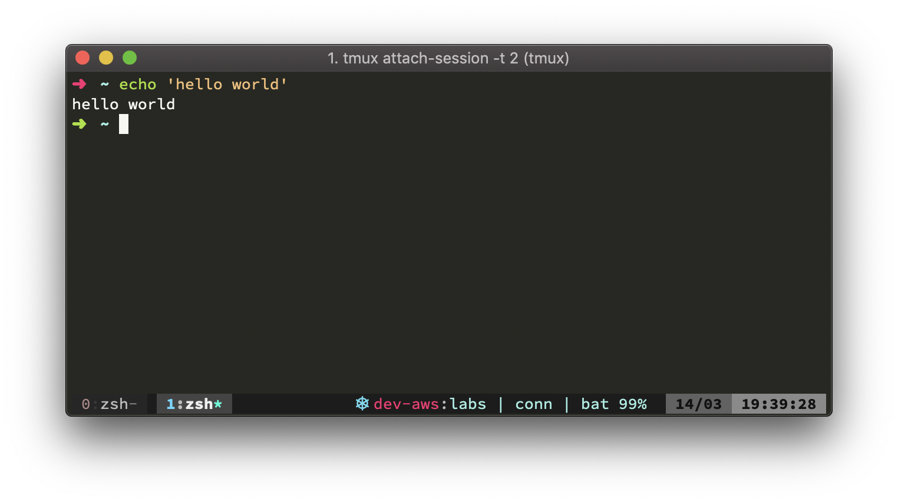

Today, Kubernetes is the de facto container orchestration solution. Together with the devops culture, developers have to get familiarised to its tools, such as `kubectl`.

After some point though, using kubectl for everything can get quite verbose, specially if you use many namespaces and contexts. The following tips try to minimise the pain of doing operations solely through it, sometimes even using other tools besides it.

## Kubectx: context and namespaces management

The operations done in kubectl usually require two params: context and namespace. Any operation will result in something as `kubectl --context dev --namespace hello-world exec -it hello-world-app-0 sh`. For a one time operation, probably it is fine, but after some point it can get cumbersome. One way to avoid these long command strings is by using [`kubectx`](https://github.com/ahmetb/kubectx).

After installing it, the context can be set simply using `kubectx dev` and the namespace as `kubens hello-world`. To list the available contexts and namespaces, just run it without arguments. This will make the above operation to be as `kubectl exec -it hello-world-app-0 sh`.

## Terminal aliases

Seasoned unix developers are quite used to terminal aliases. Some are quite popular that are even grouped in packs, such as [oh-my-zsh git aliases](https://github.com/robbyrussell/oh-my-zsh/blob/master/plugins/git/git.plugin.zsh). With Kubernetes is not that different.

Usually, having `alias k="kubectl "` already make operations shorter. Using the same example, it would give us `k exec -it hello-world-app-0 sh`. But, most likely, one alias will not be enough. There are some options for this.

The first one can be set-up in any terminal emulator (zsh, bash...). Get the `.kubectl_aliases` file from [`ahmetb/kubectl-aliases`](https://github.com/ahmetb/kubectl-aliases) and place it in your home directory. After sourcing it on `.zshrc` or `.bashrc`, 600 aliases will be available out-of-box.

```bash
# insert it in your .zshrc or .bashrc file
[ -f ~/.kubectl_aliases ] && source ~/.kubectl_aliases
```

If [`zsh`](http://zsh.sourceforge.net/) and [`oh-my-zsh`](https://ohmyz.sh/) are already set-up, an easier option would be using the pre-installed `kubectl` plugin. To enable it, edit your `.zshrc` and add `kubectl` to the `plugins` variable ([more details about oh-my-zsh plugins here](https://github.com/robbyrussell/oh-my-zsh#plugins)).

There are fewer aliases compared to `ahmetb/kubectl-aliases`, making it easier to learn and faster to load. The list of `oh-my-zsh/kubectl` aliases is [ available here ](https://github.com/robbyrussell/oh-my-zsh/tree/master/plugins/kubectl)

`kubectx` and `kubens` do not have aliases by default. To allow shorter calls for it, place the following on `.zshrc` or `.bashrc`.

```bash
# .zshrc/.bashrc configs...
alias kns="kubens"
alias kcx="kubectx"
```

After all these aliases been set-up, the `hello-world-app-0 sh` can be accessed using a simple `keti hello-world-app-0 sh`. As games, it will be as learning combat combos, although it will not be as close as a Hadouken combo.

## Terminal namespace and context indicator

Developers are humans (in case you didn't know) and humans do not have bulletproof memory. One can forget that kubernetes context is set to production and then run `kubectl apply` against production (instead of dev).

To avoid this, an indicator can be used in the terminal to show what is the actual context and namespace. The easiest way to do it is by using [`kube-ps1`](https://github.com/jonmosco/kube-ps1). It already comes with `oh-my-zsh`, requiring `kube-ps1` to be added on `.zshrc` plugins variable.

After installing or enabling, the PS1 needs to be changed to include the kubectl context and namespace informations. This can be easily done by adding `export PS1='$(kube_ps1) '$PS1` to your `.bashrc/.zshrc` file. The final result will be something as the following.


The only issue with `kube-ps1` is, when used with `git` plugin in zsh, it can generate really long PS1 strings. If `tmux` is used, it can be actually set-up in the sidebar using [`kube-tmux`](https://github.com/jonmosco/kube-tmux) plugin, avoiding PS1 cluttering.



## Investigating logs: the sane way

Failures can happen, debugs are required and sometime just check is necessary. For all of these, application logs need to be checked. The standard way to do it is:

```
kubectl --namespace dev --context labs get pods
# get the pod id
kubectl --namespace dev --context labs logs <pod-id> -f
```

If the pod is killed and restarted, the process has to be repeated as the pod id will change. Besides, the `kubectl` logs tools is quite simple in terms of features. [`stern`](https://github.com/wercker/stern) is meant to be more powerful and allows to tail multiple pods and containers at once (even the whole namespace, if required).

To tail pods, such as the hello-world example, `stern hello-world` will do. It would tail everything using the `*hello-world*` as expression. If multiple pods were been run, it would log all hello-world pods.

Shorter calls can be done setting up an alias, such as `alias s='stern'`. It always uses the `kubectx` and `kubens` settings, but it works as `kubectl` as well, accepting `--namespace` and `--context`.

## Automatic deployments

An way to avoid touching prod enviroment using kubectl, is by setting up [`kube-applier`](https://github.com/box/kube-applier). This service auto-deploy changes on infrastructure changes, based on a git repository.

It runs as a separate pod, watching a kubernetes manifest repository and comparing to deployed services. If there is a difference between manifests, it will automatically apply what is in the git repository, making it the source of truth on kube manifests.

After installing `kube-applier`, no deploys can be done through `kubectl`, as it will always revert to git manifests. This avoids confusions around deployments made in a rush, not merged and then rollbacked by a mistake.

## Conclusion

These are just some tricks I use in my daily kubernetes life. I hope you enjoy and have a good coding week 😉

## References

- Cover photo by [Cameron Venti](https://unsplash.com/photos/QtETdXXR7gs?utm_source=unsplash&utm_medium=referral&utm_content=creditCopyText) on Unsplash
- [`kubectx` repo](https://github.com/ahmetb/kubectx)
- [`ahmetb/kubectl-aliases` repo](https://github.com/ahmetb/kubectl-aliases)
- [`oh-my-zsh` repo](https://github.com/robbyrussell/oh-my-zsh)
- [`oh-my-zsh` kubectl info](https://github.com/robbyrussell/oh-my-zsh/tree/master/plugins/kubectl)
- [`kube-ps1` repo](https://github.com/jonmosco/kube-ps1)
- [`oh-my-zsh` kube-ps1 info](https://github.com/robbyrussell/oh-my-zsh/tree/master/plugins/kube-ps1)
- [`kube-tmux` repo](https://github.com/jonmosco/kube-tmux)
- [`stern` repo](https://github.com/wercker/stern)
- [`kube-applier` repo](https://github.com/box/kube-applier)
