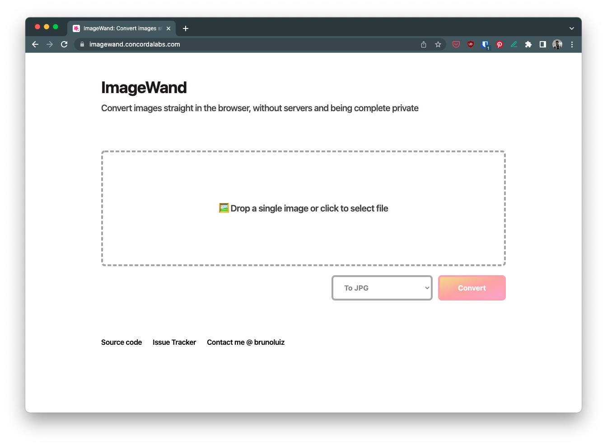
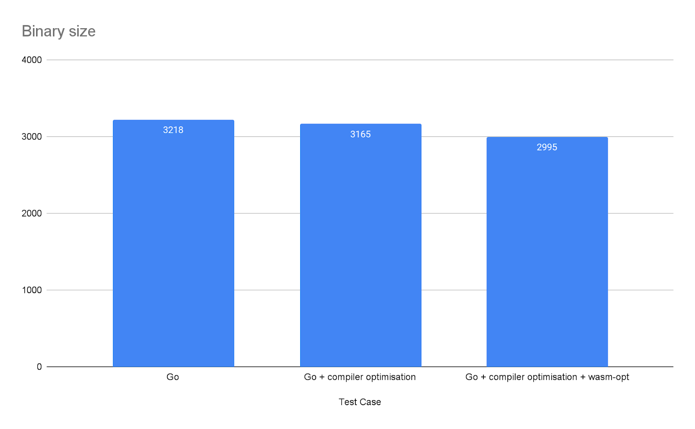
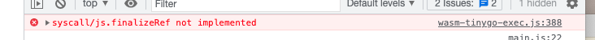
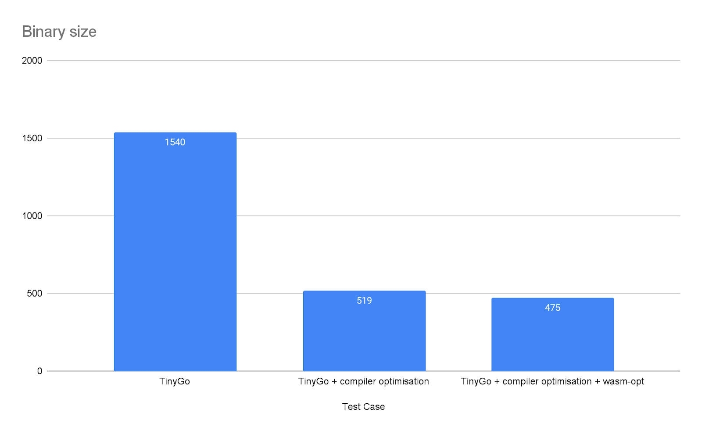
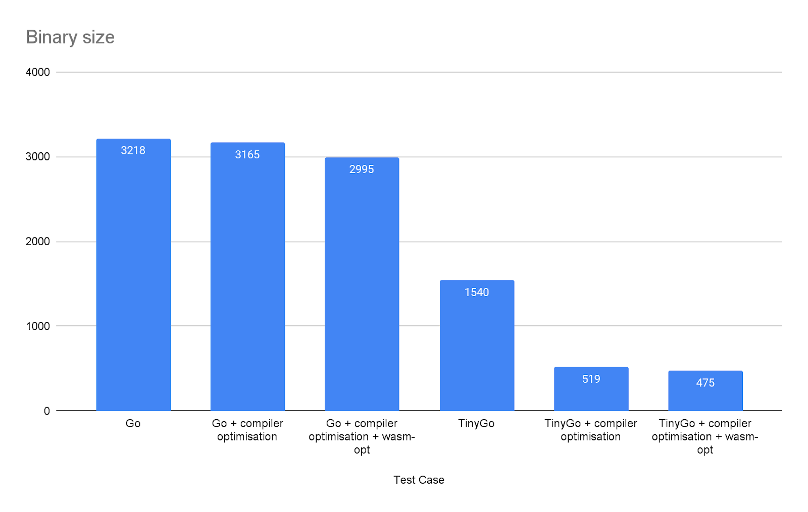

> 🧭 If you are looking for ImageWand repository, head to [brunoluiz/imagewand](https://github.com/brunoluiz/imagewand)

At the beginning of the year, I was curious about WebAssembly (WASM). [The result was GIFSane](https://brunoluiz.net/blog/2022/jan/gif-sane-playback-control-ffmpegwasm/), but that was not enough: [FFMpeg.wasm](https://github.com/ffmpegwasm/ffmpeg.wasm) was already pre-compiled, and I only had to sort out how to use it within an extension. One thing was clear though: WASM shines when we think about complex applications (eg: media manipulation), usually performing better or opening more opportunities than JavaScript.

I've moved houses quite recently. It meant manipulating tons of documents, converting to different formats, resizing etc. Mac's Preview app can handle it, but many might rely on browsers due to the first search results for "Convert image format1 format2". Seriously, look at these Google results.


When someone is converting a puppy image from JPG to PDF this might be ok. But after hearing that my family used these sites to convert documents like Passports, I got scared. Most people don't realise that these files go to a server, and they can be stored for whatever reason and for an indefinite time. "Identity theft" sends its regards 😅

What if there was some website to convert images locally, without requiring a server? What if the technology for that already exists? That is when I started developing [ImageWand](https://imagewand.concordalabs.com/) ([source](https://github.com/brunoluiz/imagewand)).

## Converting your images locally and privately: ImageWand

ImageWand converts images locally using WASM and Golang. In the future, it could potentially resize and compress images, but I tried to keep it simple by only using standard libraries encoders and decoders (no PDF for now).

It seems that Rust would have been a more solid choice for WASM, but I would have to learn it to develop this project. Rust is famous for its [steep learning curve](https://users.rust-lang.org/t/making-rust-easy-to-learn-and-use/65866/3) and, to keep things simple and focused, I went with Golang.


<center>
  <small>Less is more, although I guess the application could benefit from more features 😅</small>
</center>

## The building experience

Golang offers some standard libraries for image manipulation ([`image` package](https://pkg.go.dev/image)). Implementing something to convert A to B wasn't the hard part. [The conversion logic was extracted and re-used](https://github.com/brunoluiz/imagewand/blob/v1.0.0/imagewand.go) in both CLI and WASM implementations, which is impressive in terms of portability.

### Covering the basics: interfacing with user input

In a CLI, the application can receive user input through flags or arguments. In WASM, things are a bit peculiar as inputs have to come from JavaScript into Golang.

You can instantiate and load the WASM binary for every call, similar to a CLI call, but it would be an expensive operation. The best way is to run it in the background ([observe the use of a channel to keep it running](https://github.com/brunoluiz/imagewand/blob/v1.0.0/cmd/wasm/main.go#L54)) while developers call it through a JavaScript interface.

In Golang, this is done by [exposing global JavaScript objects/functions within `main()`](https://github.com/brunoluiz/imagewand/blob/v1.0.0/cmd/wasm/main.go#L51-L53). It is not great as it might conflict with other variables and it pollutes the global scope. Other WASM implementations (Rust or TinyGo+WASI) [expose methods by exporting them](https://developer.mozilla.org/en-US/docs/Web/JavaScript/Reference/Global_Objects/WebAssembly/Instance/exports) in the WASM instance, which is cleaner than relying on global variables.

```go
func main() {
  fmt.Println("Starting ImageWand 🪄")

  js.Global().Set("wand", map[string]interface{}{
    "convertFromURL": convertFromURL(),
    "convertFromBlob": convertFromBlob(),
  })
  <-make(chan bool)
}
```

### Interacting with "JavaScript-land"

To declare and interact with JavaScript in Golang runtime, developers rely on [`syscall/js`](https://pkg.go.dev/syscall/js). This package allows the application to create functions, read values from JS objects (DOM and non-DOM) and interface byte arrays with JS values (specifically: `UInt8Array`). The only caveat is the following, been present since its release on Golang 1.11.

> _This package is EXPERIMENTAL. Its current scope is only to allow tests to run, but not yet to provide a comprehensive API for users. It is exempt from the Go compatibility promise._

Although it allows all sorts of interactions with JavaScript, in my limited experience with it, I would recommend developers to only use it to interface user inputs between Golang and the JavaScript runtime.

If you want to manipulate DOM or create elaborate objects through Golang, you might be in a world of pain. Not only there are no typing guarantees, but the tooling for those is just not there. ImageWand only uses it to gather user input to call `imagewand` conversion functions, essentially a glue between the UI and Golang.

I've [created an internal package (jasm)](https://github.com/brunoluiz/imagewand/blob/main/jasm/wasm.go) with a few helper functions to interface with JavaScript values. [It made `wasm/main.go` way cleaner](https://github.com/brunoluiz/imagewand/blob/main/cmd/wasm/main.go#L20-L48), but certainly the most important of all is the `Await` method.

### Golang and JavaScript promises

JavaScript applications are single-threaded and leverage an event-loop strategy. Certain tasks might cause it to block, such as disk or network operations. JavaScript can schedule these operations by spinning processes off the event-loop, without blocking the main thread. A common way of doing[it is through Promises](https://developer.mozilla.org/en-US/docs/Web/JavaScript/Guide/Using_promises).

Golang HTTP calls are [using JavaScript's `fetch`](https://developer.mozilla.org/en-US/docs/Web/API/Fetch_API) under the hood, for example. This results in a blocking operation (network call), which needs to be handled properly. Using `net/http` functions incorrectly will result in a runtime deadlock error. It is a common mistake, been even pointed out on the [`syscall/js.FuncOf` documentation](https://pkg.go.dev/syscall/js#FuncOf):

> Invoking the wrapped Go function from JavaScript will pause the event loop and spawn a new goroutine. Other wrapped functions which are triggered during a call from Go to JavaScript get executed on the same goroutine.
>
> As a consequence, if one wrapped function blocks, JavaScript's event loop is blocked until that function returns. **Hence, calling any async JavaScript API, which requires the event loop, like fetch (http.Client), will cause an immediate deadlock. Therefore a blocking function should explicitly start a new goroutine.**

Starting goroutine solves event loop blocking. Image processing would definetely be a blocking operation and definitely be spun up in a goroutine. But, JavaScript doesn't "understand" them, and the application needs to signal JavaScript runtime to wait for its results. The easiest way is to create a `Promise` through `syscall/js` and call `resolve()` through the goroutine.

As it is a bit of a long piece of code, abstraction is vital. In ImageWand, this is dealt with through [the jasm.Await function](https://github.com/brunoluiz/imagewand/blob/main/jasm/wasm.go#L37-L57).

```go
func Await(cb func() (js.Value, error)) js.Value {
  handler := js.FuncOf(func(this js.Value, args []js.Value) interface{} {
    resolve := args[0]
    reject := args[1]

    // This would be the function I want to deal with
    go func() {
      res, err := cb()
      if err != nil {
      reject.Invoke(Error(err))
        return
      }

      resolve.Invoke(res)
    }()

    return nil
  })

  return promiseJS.New(handler)
}
```

This way, any blocking operation can be created as a promise by wrapping it through this. There is a pull request open at `golang/go` [that implements a better version of this snippet](https://github.com/golang/go/pull/52581), perhaps landing in a future version of Go.

## Optimisations

Once the proof of concept was up and running, there was a problem: binary size. At this point, building without any optimisation generated a 3.2Mb binary. Not ideal for mobile usage.

```shell
GOOS=js GOARCH=wasm go build -o ./app/wasm/main-go.wasm ./cmd/wasm
```

The first optimisation one can do is to disable the injection of debugging information on build time through `ldflags`. For ImageWand, it reduced the binary to 3.1Mb (2%). Although quite low effort, it doesn't help much.

```shell
GOOS=js GOARCH=wasm go build -o ./app/wasm/main-go-optimal.wasm -ldflags="-s -w" ./cmd/wasm
```

Tools like [`twiggy` can help analyse the binary size](https://rustwasm.github.io/twiggy/) as well. There wasn't much to tweak in this case, but I recommend giving it a try. The one that everyone recommends though, regardless of language, is `wasm-opt` from the [`binaryen` toolchain](http://webassembly.github.io/binaryen/).

It allows many optimisations, but it requires a bit of tweaking per-project basis. After playing around with it, the previous optimised binary with `-Oz` produced the best results: a 2.9Mb binary, a 7% reduction compared to the original binary.

```shell
wasm-opt -Oz -o ./app/wasm/main-go-optimal-binaryen.wasm ./app/wasm/main-go-optimal.wasm
```

With Golang compiler, this is as far as I could go with optimisations. Even considering Gzip, it didn't look great. It is not rare to find websites reaching 1Mb nowadays but, for such a simple project, 2.9Mb is unacceptable.


<center>
  <small>Binary size per optimisation: no excessive gains, but still something</small>
</center>

## TinyGo: a better compiler for WASM?

I heard about [TinyGo](https://tinygo.org/) sometime ago. With the slogan "A Go Compiler For Small Places" and a focus on embedded systems, I never got on the hype train. It is a subset of the Golang language, which means [there are some limitations](https://tinygo.org/docs/reference/lang-support/) and not all packages will work on it, even the [ones in the standard library](https://tinygo.org/docs/reference/lang-support/stdlib/). This means it is not exactly a drop-in for all scenarios.

But, besides embedded systems, it seems to be a quite popular WASM compiler. The binaries produced, being a subset and focused on "small places", are quite small. Taking into consideration the supported packages and limitations, it seemed a good candidate for ImageWand.

### Almost a drop-in replacement

The first thing I tried was to compile the program using TinyGo, without any changes. It worked incredibly well, and the binary size dropped from ~3.2Mb to ~1.5Mb. Quite an improvement, especially when the WASM target is a web browser.

This was until I checked the console. Using `.String()` to get values from `syscall/js.Value` has not been implemented. Seemingly, ImageWand hit a TinyGo limitation and a hack around would be required.

<br/>


<br/>

[There are some hacks for it](https://github.com/tinygo-org/tinygo/issues/1140), but they all have some memory leak issues. As the surface between the program functionality and `syscall/js` is quite limited, [changing those into `int` seemed a better solution (without any caveat)](https://github.com/brunoluiz/imagewand/commit/4860cb4c757c0ad859912047eb145798d47ff434).

Besides this, anyone attempting to move from Golang to TinyGo has to replace[`wasm_exec.js`](https://github.com/tinygo-org/tinygo/blob/release/targets/wasm_exec.js). [According to the documentation](https://tinygo.org/docs/guides/webassembly/#how-it-works), it is based on the Go's one, but with a couple of changes that make it incompatible. Nothing major and super easy to tackle.

Once tweaked, ImageWand was successfully compiled using TinyGo, without any error messages in runtime and a binary twice the original size (1.5Mb). Smells like progress!

### TinyGo after optimisations

Similar to Golang, the TinyGo compiler [allows tweaks](https://tinygo.org/docs/reference/usage/important-options/) according to project requirements. Considering this will be distributed on the web, optimisations related to size are important. Some might prefer performance tweaks, which are available as well.

```shell
tinygo build -o app/wasm/main-tinygo-optimal.wasm -target wasm -no-debug -gc leaking ./cmd/wasm
wasm-opt -Oz -o ./app/wasm/main-tinygo-optimal-binaryen.wasm ./app/wasm/main-tinygo-optimal.wasm
```

As in Golang though, `wasm-opt` did not result in a massive gain, but it is still something.


<center>
  <small>TinyGo binary size per optimisation: drastic improvements when applying optimisations</small>
</center>
  <br/>


<center>
  <small>Full binary size comparison from Golang to Tinygo + optimisations</small>
</center>
  <br/>

If your implementation is compatible with TinyGo and you don't fall into an edge case, go for it! It provides plenty of features, and it seems a good choice in terms of binary size, especially considering web distribution.

### WASI: interesting but not mature enough on TinyGo

At this point, ImageWand was working and it was not a large binary: I could call it a day. But, there was still one thing that I wanted to try out: [WASI](https://github.com/bytecodealliance/wasmtime/blob/main/docs/WASI-overview.md).

> WASI stands for WebAssembly System Interface. It's an API designed by the Wasmtime project that provides access to several operating-system-like features, including files and filesystems, Berkeley sockets, clocks, and random numbers, that we'll be proposing for standardisation.
>
> **It's designed to be independent of browsers, so it doesn't depend on Web APIs or JS, and isn't limited by the need to be compatible with JS**. And it has integrated capability-based security, so it extends WebAssembly's characteristic sandboxing to include I/O.

<small>ℹ️ [There is an interesting article from MDN](https://hacks.mozilla.org/2019/03/standardizing-wasi-a-webassembly-system-interface/) about the subject – It is something I definitely want to dive deeper into in the future</small>

ImageWand was relying on `syscall/js` to interface with user input, which depends on JavaScript APIs, and it wouldn't run in any other runtime besides the browser. Binaries compiled into the WASI standard though can be run anywhere that implements its specification: browser, terminal or within other backends (serverless function with NodeJS running Golang WASI bins). Yes, "Build once, run everywhere" ~~Java~~ vibes.

TinyGo supports WASI. This means  `syscall/js` is not required if you don't want to manipulate the DOM, which would have made ImageWand code simpler, becoming just an exported Golang function… But, there are a couple of limitations when implementing WASI programs with TinyGo:

1. [Function arguments and outputs can only be numbers or pointers, which are essentially numbers with a memory address](https://tinygo.org/docs/concepts/compiler-internals/calling-convention/#:~:text=The%20WebAssembly%20target%20does%20not%20return%20variables%20directly%20that%20cannot%20be%20handled%20by%20JavaScript%20(see%20above%20about%20i64%2C%20also%20struct%2C%20i64%2C%20multiple%20return%20values%2C%20etc).%20Instead%2C%20they%20are%20stored%20into%20a%20pointer%20passed%20as%20the%20first%20parameter%20by%20the%20caller.).
2. [There is no proper support for multi-return, so no easy `(someType, error)`](https://github.com/tinygo-org/tinygo/issues/3010#issuecomment-1191916589) without some hacks.
3. Lacking documentation and helper methods to operate on top of shared WASM memory ([I've opened a ticket around documentation](https://github.com/tinygo-org/tinygo/issues/3040)).

ImageWand was passing a slice of `byte` with the image content, which was the simplest way to get this working (don't io.Reader me: it is not as simple). To pass the image input and receive the output in `[]byte`, you need to use JavaScript and WASM shared memory space, pointers and all sort of low-level magic.

Checking Github, it seems many people came across the issue of passing non-numeric values or returning multiple values, and every developer has a different solution to it [[1]](https://github.com/tinygo-org/tinygo/issues/2512#issuecomment-1011399751) [[2]](https://github.com/tinygo-org/tinygo/issues/1824).[Eventually, I came up with my way of dealing with this](https://github.com/brunoluiz/imagewand/pull/4),  but it is quite ugly and probably not efficient at all. Most likely I should have used [`WebAssembly.memory.buffer`](https://developer.mozilla.org/en-US/docs/Web/JavaScript/Reference/Global_Objects/WebAssembly/Memory), but I couldn't find an easy way of doing so. Besides, WASI was an extra in this whole experiment and, at this point, I had invested a long time cracking my head to have at least something minimal working.

```js
// JavaScript code
new Uint8Array(buf).forEach((b) => imagewand.appendToBuffer(b));
await imagewand.convertFromBlob(formatToNumber(format));

const outputSize = imagewand.getOutputSize();
const arrayBuffer = new Uint8Array(outputSize);

for (let i = 0; i < outputSize; i++) {
  arrayBuffer[i] = imagewand.getOutputAtPos(i);
}
```

```go
// Golang code
type image []byte
var input image;
var output image;

//export appendToBuffer
func appendToBuffer(i byte) {
  input = append(input, i)
}

//export getOutputSize
func getOutputSize() int {
  return len(output)
}

//export getOutputAtPos
func getOutputAtPos(i int) byte {
  return output[i]
}

// Other stuff

//export convertFromBlob
func convertFromBlob(format int) {
  img, err := imagewand.New(bytes.NewBuffer(input))
  if err != nil {
    panic(err)
  }

  f, ok := fileFormatFromInt[format]
  if !ok {
    panic("format not supported")
  }

  b := bytes.NewBuffer([]byte{})
  if err := img.Convert(b, f); err != nil {
    panic(err)
  }

  output = b.Bytes()
  input = []byte{}
}
```

These limitations and lack of documentation around WASI, workarounds and common examples for TinyGo make it quite hard to abandon `syscall/js` for browser apps or use it for non-JS WASM applications. Although I managed to make it work, I wouldn't recommend someone to drop `syscall/js` in favour of WASI TinyGo for browser applications at the moment, only if the person wants to deep dive and study its details. If you decide to do so, please help the community by adding examples, tutorials and documentation to the official project page.

## Conclusions on using Golang with WASM

Being able to re-use and compile Golang code into WASM is exciting. Besides, for those used to Golang as their daily driver, it might be a natural choice when considering complex applications.

In general, I always recommend Golang due its tooling. But, for WASM, my experience was quite bumpy:

* The final binary size using Golang toolchain (around 3.2Mb) might be OK for the backend but not for frontend apps. This adds up when considering network outbound costs or slow mobile connections.
* TinyGo is an amazing alternative, but you might fall into edge-cases or unsupported features. This is quite an annoyance but, if you manage to get your way around it, it is probably the perfect choice for your Golang WASM project.
* CI pipelines will get more complex as Golang/TinyGo tooling needs to be handled, and [extra build steps are required](https://github.com/brunoluiz/imagewand/blob/v1.0.0/.github/workflows/deploy.yaml). Not that JavaScript toolchain is not complex by itself already.
* The use of `syscall/js` is quite cumbersome and unsafe, but mostly because of the JavaScript nature.
* Dealing with DOM elements is possible, but changing UI elements is quite a painful and complex task. Try to limit its use only as glue.
* Golang WASM is an independent and experimental port. [There are discussions on how to deal with such ports](https://github.com/golang/go/issues/53383), but it is something to bear in mind. Besides, as it is still not a stable API, it might change at any point (although it never changed since its release).
* WASI support is Golang does not exist at the moment, and TinyGo is not the most ergonomic in terms of WASI development, with a lack of documentation and examples. This can be mostly due to the WASI specification, as it is still in progress, but things like `wasm-bindgen` for Rust prove that it could be somehow possible.

Would I choose Golang for a WASM project? If I had to develop something quickly or the people involved are used to Golang, definitely yes (TinyGo, to be fair). But I feel it is not the best choice in terms of features, documentation, toolchain and support. C/C++ and Rust seem to lead the way.

I never programmed with Rust before, but considering its support to WASM and some other interesting use cases I have in mind, it is perhaps a sign that I should finally try to learn it.

* [🔗 ImageWand project page](https://imagewand.concordalabs.com)
* [💾 ImageWand source code](https://github.com/brunoluiz/imagewand)
* [💬 Reach me on Twitter @ brunoluiz](https://twitter.com/brunoluiz)

## References

1. [Go, WebAssembly, HTTP requests and Promises](https://withblue.ink/2020/10/03/go-webassembly-http-requests-and-promises.html)
1. [MDN: Transferable objects](https://developer.mozilla.org/en-US/docs/Glossary/Transferable_objects)
1. [Running Go in the Browser with WASM and Web Workers](https://qvault.io/golang/running-go-in-the-browser-wasm-web-workers/)
1. [Using WebAssembly with Web Workers](https://www.sitepen.com/blog/using-webassembly-with-web-workers)
1. [Shrink Your TinyGo WebAssembly Modules by 60%](https://www.fermyon.com/blog/optimizing-tinygo-wasm)
1. [Are We Wasm Yet ? - Part 1](https://elewis.dev/are-we-wasm-yet-part-1)
1. [Are We Wasm Yet ? - Part 2](https://elewis.dev/are-we-wasm-yet-part-2#heading-server-implementation)
1. [Standardizing WASI: A system interface to run WebAssembly outside the web](https://hacks.mozilla.org/2019/03/standardizing-wasi-a-webassembly-system-interface/)
1. [WASI](https://wasi.dev/)
1. [WebAssembly Linear Memory example](https://wasmbyexample.dev/examples/webassembly-linear-memory/webassembly-linear-memory.go.en-us.html#)
