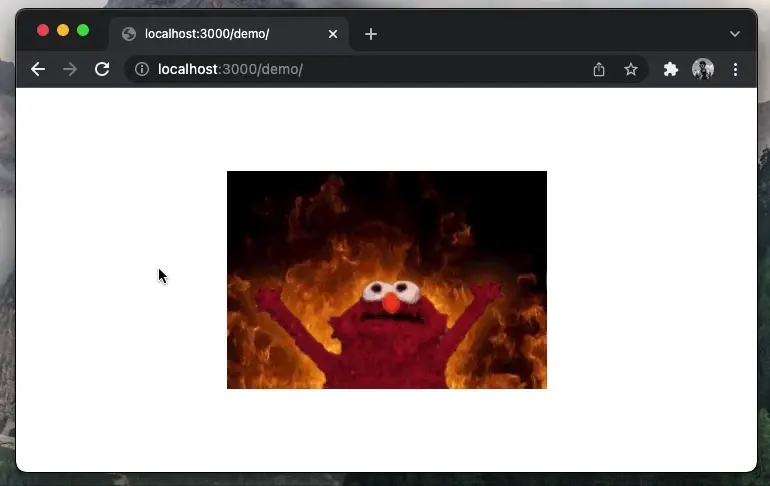

Animated images in GIF format are around for a long time. They were first released in 1987 by CompuServe. Yep, your maths are correct: they came even before browsers. It was not until Netscape 2.0 that the GIF format was incorporated and conquered the world ([really][1]).

They are everywhere: from memes to artsy GIFs, they come in all shapes and formats. The software engineering world adopted them for a particular use case: recording tutorials and demos.

Markdown probably is to blame here. Embedding a GIF into your Github page, static blog or NPM package, which tend to use Markdown, is the easiest way to embed a "video-like" component: `` and all good.

GIFs are ominous nowadays, being more popular than even newer and more efficient formats, such as [WEBP][2] or [APNG][3]. But, depending on their length and what has been recorded, you might want to pause, go back, jump sections etc. Video playback features basically... which GIFs don't have.

Not having this feature always annoyed me a bit. I always _secretly_ hoped that one day browsers would support this. This day never arrived, and I decided to take matters into my own hands.

## Browser extensions: a ticket to heaven?

Some time ago, I was a bit annoyed with Grammarly. As a non-native English speaker, it helps me a lot when writing technical documents or blog posts. But these documents had to be exported to Markdown.

At some point, I got annoyed by the lack of this feature, and I decided to create a browser extension to solve that: [Grammarly to Markdown][4] ([GitHub][5]). This was 2019, and I still use it nowadays.

Then, last year, James Long published [_A future for SQL on the web_][6], where he describes how to use SQLite in the browser. "SQLite, in the browser!? How!?" you may ask. Well, dear friend, there is this magical thing called [_WebAssembly_][7]. In this case, it allows JavaScript to interoperate with libraries and programs written in other languages, such as SQLite.

I already knew about the existence of WASM, but this post was eye-opening. I realised it opens many interesting possibilities and, during my search for other projects, I came across [FFmpeg.wasm][8].

At some point last year, my annoyance with GIFs came about again. I tried some extensions, but the UI and UX were never that friendly. I was expecting something like HTML playback control.

With my "_fresh"_ knowledge about WASM, I thought: wait a second, what if I created a browser extension that converted GIFs into videos using FFMPEG!? Guess what: I did it again.

## FFmpeg.wasm + Browser Extension: GIFSane



_Fun fact: the demo above is in WebP, so GIF wouldn't be able to convert 🤷_

After a couple of weeks of hacking things, I managed to put together [GIFSane][9]. It allows users to either convert and replace the image component or download the converted result straight (QuickTime can't open it though). For now, I can't publish in Chrome Web Store (more details on sections ahead), but you can still load it manually (instructions on the repository).

It is not as fast as a "bare-metal" FFmpeg (no hardware acceleration) but is way more convenient. Besides, it was a great opportunity to learn more about WebAssembly.

Creating extensions, however, can always be tricky. There are lots of caveats, tricks and not properly documented APIs. It is certainly not an easy and quick project to hack around. Besides, FFmpeg.wasm has its own set of limitations (or rather WASM itself).

## Here be dragons: extensions using WASM and FFmpeg

Differently from frontend and backend, where there are lots of materials, tutorials and frameworks, extensions are quite the opposite.

I will not go through the whole implementation. Instead, I will go through my main learnings in this project, mostly around WASM and FFmpeg. The extension itself is simply architected, and you can [explore it at GitHub][10].

### Manifest V3 vs V2 (January 2022): limitations everywhere

Manifest V3 will be a requirement from January 2023 onwards. If you want to publish an extension to Chrome Web Store, be aware that only Manifest V3 is accepted currently.

Chrome-based engines are the only ones supporting it, while Firefox is still on Manifest V2. This means that you might have to support two versions of the same extension. [Mozilla is supposed to release its implementation soon][11], but it seems there will be divergences.

For GIFSane though, I couldn't even use Manifest V3. As of January 2022, [it still does not support WASM][12]. Developers who want to build on top of WASM still need to wait. Hence why it is not available on Chrome Web Store.

Besides, background scripts [need to be migrated to service workers.][13] Depending on the implementation, this might be tricky. FFmpeg.wasm, for one, uses `[URL.createObjectURL()][14]` and `document.\*` in its browser version, both not available in workers.

### SharedArrayBuffer & SPECTRE

To make use of multi-threading, applications compiled with WASM require `SharedArrayBuffer`. But, since [SPECTRE][15] (the security vulnerability, not the Bond movie), this has been a minefield for browsers.

All major browsers [disabled it at the start of 2018][16], only re-enabling it in 2020. If you want a website to use this, you need to set `Cross-Origin-Opener-Policy` and `Cross-Origin-Embedder-Policy` headers. [Extensions have to set those as well][17] to be able to use WASM.

The caveat is that, on Firefox, [extensions can't use `SharedArrayBuffer`][18]. Only a few [privileged extensions can][19], which forbids the usage of multi-threaded WASM extensions on Firefox.

### Single-threaded FFmpeg.wasm is possible 🚀


<!-- Photo by <a href="https://unsplash.com/@lazycreekimages?utm_source=unsplash&utm_medium=referral&utm_content=creditCopyText">Michael Dziedzic</a> on <a href="https://unsplash.com/s/photos/fix?utm_source=unsplash&utm_medium=referral&utm_content=creditCopyText">Unsplash</a> -->

On the bright side: WASM applications can be compiled to single-threaded, and FFMPEG.wasm is no different. It removes the need for `SharedArrayBuffer` with the only caveat being it will be certainly slower.

As of January 2022, there is no "pre-packaged" FFMPEG.wasm available with single-threaded support. But [@jeromewu][20] already pushed the required changes to compile it. This means you will need to get your hands a little bit dirty.

**Build `ffmpeg.wasm-core`**

You can build manually by heading to [https://github.com/ffmpegwasm/ffmpeg.wasm-core][21] and following the instructions. Or, you can use GitHub Actions in your favour:

- Fork the project: [https://github.com/ffmpegwasm/ffmpeg.wasm-core][22]
- Enable the GitHub Actions (just go to the Actions tab)
- Push a dummy commit
- There should be two workflows running in your GitHub Actions: select `Build FFmpeg.wasm (Single Thread)`
- It will take ages to compile: go make a coffee ☕️
- Once finished, download the artefacts (bottom of the page)

Now you should have a working single-thread version of it.

**Build `ffmpeg.wasm`**

If you change the `corePath` param of `createFFmpeg` to use the single-threaded version, you will realise that it still does not work. Worse: now it errors with:

```
[fferr] Assertion failed: Cannot call unknown function proxy_main, make sure it is exported
Uncaught (in promise) RuntimeError: abort(Assertion failed: Cannot call unknown function proxy_main, make sure it is exported). Build with -s ASSERTIONS=1 for more info.
```

When you build without multi-threading, `proxy_main` is not published anymore. From what I understood, this is because `proxy_main` is used as a "proxy" entry point by ECMScripten when dealing with multi-threading + workers just so it doesn't block the main thread ([more details here][23]). With the single-threaded binary, this proxy will not be available. Instead, you should use `main`.

There [is a fix for this already][24], but it still hasn't been merged. Guess what: time to get your hands dirty again:

- Fork the project: [https://github.com/ffmpegwasm/ffmpeg.wasm][25]
- Apply the patches from [https://github.com/ffmpegwasm/ffmpeg.wasm/pull/235/files][26]
- Build the package with `npm ci && npm build` (no coffee this time, it is quick to compile)

You can now use the single-threaded FFmpeg.wasm in your project:

```js
const ffmpeg = createFFmpeg({
  corePath: './<path-to-ffmpeg-core-dist>/ffmpeg-core.js',
  mainName: 'main'
});
```

If you want your extension to support both, you will have to keep both WASM files and change things in build time ([I used symbolic links][27]). You need to detect the browser and change the `mainName` entry point during run-time ([a bit tricky in extensions][28]).

### No MP4/H.264 support on Firefox

[Firefox does not include the required codecs to play MP4 (H.264)][29]. I always thought it got open-sourced at some point, but I was clearly too naive. Instead, they recommend WebM (VP9).

FFmpeg.wasm supports both. But, there is a catch: GIF to WebM encoding is slower than MP4's. Sadly, Firefox users have a double performance penalty with FFmpeg.wasm. Either way, slow is better than nothing, and GIFSane supports WebM encoding as well.

### Dealing with CSP headers to inject Blobs (FFmpeg output) in any page

Initially, GIFSane used a content script to run FFmpeg. But:

1. It was inefficient, as all pages loaded GIFSane resources (mainly ffmpeg.wasm)
2. Some websites `[Content Security Policy][30]` block any content injection to it. GitHub is quite aggressive in these policies, for example.

Once FFmpeg.wasm was moved to a background script, I managed to run FFmpeg and convert GIFs. It still required a hack to pass the final MP4 from the background to the content script. This is because extensions don't emit JS objects, but stringified versions of them instead. I obviously found my way 🤷 ([exhibit A][31], [exhibit B][32]).

But, even with this workaround, I couldn't inject the blob into the page. Some websites declare `media-src` in their CSP headers, which blocks media injection (like blobs). Another ~duct tape~ hack had to be applied, with a little help from `chrome.webRequest.onHeadersReceived`.

With this API, the `onHeadersReceived` is called once the page HTTP Headers are received. GIFSane reads them and changes them just a tiny bit: [it adds `blob:` to the CSP `media-src`][33]. After that, the GIFSane content script can replace the GIF with the FFmpeg output. I am not sure if this is a reason for security concerns, but it was my only way around it (please, [ping me on Twitter][34] if it is).

## Final words


Creating GIFSane was an interesting challenge. I now want to go deeper into WASM and perhaps convert a project myself (I am open to ideas).

Because it doesn't have hardware acceleration, it is a bit slow at times. As long as developers don't push 5 minutes GIFs, FFmpeg.wasm should be enough. If not, I might create an external agent which calls a bare-metal FFmpeg.

Closer to the end of the year, I will revisit this post and GIFSane due to Manifest V3 migrations. Expect a Part II soon 👀

- [🔗 GIFSane project page](https://github.com/brunoluiz/gifsane)
- [💬 Reach me on Twitter @ brunoluiz](https://twitter.com/brunoluiz)

[1]: https://www.vox.com/culture/2017/6/15/15802136/gif-turns-30-evolution-internet-history
[2]: https://developer.mozilla.org/en-US/docs/Web/Media/Formats/Image_types#webp_image
[3]: https://developer.mozilla.org/en-US/docs/Web/Media/Formats/Image_types#apng_animated_portable_network_graphics
[4]: https://brunoluiz.net/grammarly-markdown-extension/
[5]: https://github.com/brunoluiz/grammarly-markdown-extension
[6]: https://jlongster.com/future-sql-web
[7]: https://developer.mozilla.org/en-US/docs/WebAssembly/Concepts
[8]: https://github.com/ffmpegwasm/ffmpeg.wasm
[9]: https://github.com/brunoluiz/gifsane-extension
[10]: https://github.com/brunoluiz/gifsane-extension
[11]: https://blog.mozilla.org/addons/2021/05/27/manifest-v3-update/
[12]: https://bugs.chromium.org/p/chromium/issues/detail?id=1173354
[13]: https://developer.chrome.com/docs/extensions/mv3/intro/mv3-overview/#service-workers
[15]: https://meltdownattack.com/
[16]: https://developer.mozilla.org/en-US/docs/Web/JavaScript/Reference/Global_Objects/SharedArrayBuffer#security_requirements
[17]: https://developer.chrome.com/docs/extensions/mv2/manifest/cross_origin_embedder_policy/
[18]: https://bugzilla.mozilla.org/show_bug.cgi?id=1674383
[19]: https://bugzilla.mozilla.org/show_bug.cgi?id=1674383#c33
[20]: https://github.com/jeromewu
[21]: https://github.com/ffmpegwasm/ffmpeg.wasm-core
[22]: https://github.com/ffmpegwasm/ffmpeg.wasm-core
[23]: https://emscripten.org/docs/porting/pthreads.html
[24]: https://github.com/ffmpegwasm/ffmpeg.wasm/pull/235
[25]: https://github.com/ffmpegwasm/ffmpeg.wasm-core
[26]: https://github.com/ffmpegwasm/ffmpeg.wasm/pull/235/files
[27]: https://github.com/brunoluiz/gifsane-extension/blob/main/package.json#L8-L9
[28]: https://github.com/brunoluiz/gifsane-extension/blob/main/src/handlers/ffmpeg-handler.js#L1-L9
[29]: https://support.mozilla.org/en-US/kb/html5-audio-and-video-firefox#w_patented-media
[31]: https://github.com/brunoluiz/gifsane-extension/blob/main/src/handlers/ffmpeg-handler.js#L71-L78
[32]: https://github.com/brunoluiz/gifsane-extension/blob/main/src/content.js#L49-L50
[33]: http://chrome.webRequest.onHeadersReceived
[34]: https://twitter.com/brunoluiz
