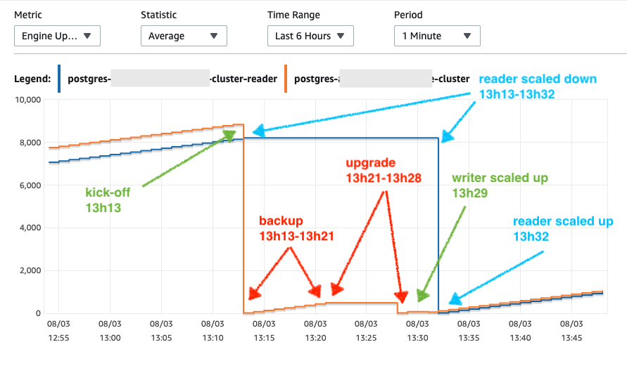
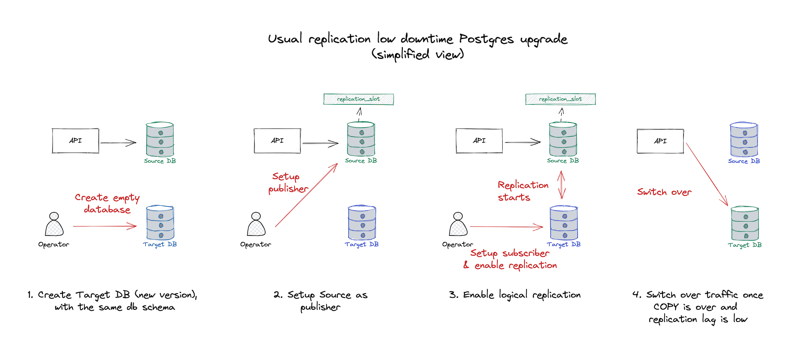
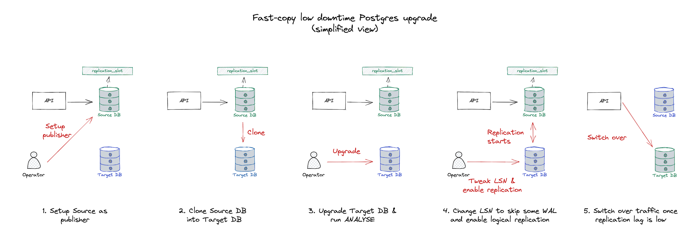
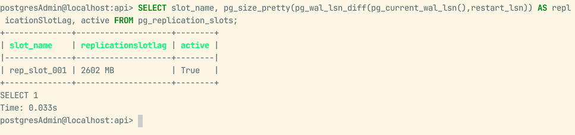

<!-- https://unsplash.com/photos/RIb4BDwiakQ -->

> 💡 This post will describe the upgrade process, explore alternatives and what was the final choice. A subsequent post will have a detailed step-by-step guide on the chosen strategy.

Postgres is one of the developer's favourite databases. It is available in most cloud providers, and companies can go years with Postgres features solely. But, as with everything, Postgres could be better in some aspects. The article ["Things I hate about Postgres"][1] list some of these points, for example. Until last year, I was mainly using [CockroachDB][2], but since I changed companies, Postgres and its peculiarities hit me every now and then.

The services using Postgres the company I am working for deal with a large request volume, and due to its financial nature, downtimes are frowned upon (perhaps not the ideal choice for this, but that is a topic for another post). Failovers are never 100% clean, and configuration tweaks might result in a writer instance restart. Happily, there are ways to circumvent minor database downtimes, such as request retries and leveraging pgBouncer. **But what about upgrades?**

[Minor versions are not risky][3], as they don't change the file system. The only downtime required is when it is restarting the instance with the new version. Some coordination is required (reader upgrades first, then writer), but managed solutions deal with this automatically. Some, such as AWS and GCP, even provide [zero-downtime patching][4].

But, major upgrades are way more complex: because Postgres [needs to change the underlying filesystem][5], all instances need to be shut down from traffic during the upgrade. There is no easy way out, and as of October 2022, managed solutions don't provide any "magical" low-downtime solution.

With [AWS end-of-life for Aurora Postgres 10 on January 2023][6], potential performance gains and Graviton instances availability only on newer versions, upgrading Postgres became a high priority. The catch? No one had ever done major upgrades in the company without downtime, and our customers wouldn't welcome a long downtime.

## The race was on

> 💡 The company uses AWS Aurora Postgres, which has some extra features and peculiarities compared to Postgres.

The most straightforward path would be an in-place upgrade. To try this, I created an instance in our staging environment (with ~1Tb) and triggered an in-place upgrade. To my negative surprise, it took around 15 minutes + a variable execution time for ANALYSE: an unacceptable downtime for a high-traffic service. We tried with smaller and larger databases, but the time was around ~15 minutes as well.

<small><em>Database uptime x in-place upgrade timing from CloudWatch metrics</em></small>

After this initial reality shock and a few days of research, a couple of options came across:

1.  **Native logical replication:** this method would allow us to replicate the database using native features. Postgres runs an initial `COPY` and then syncs out new operations to the target database (more on that later).
2.  **Data migration tool (AWS DMS):** it seemed to use logical replication underneath, combined with some cloud-provider magic. From the initial research, it seemed the most robust option.
3.  **Logical replication on a cloned database:** exact as the native, but it uses some hacks to trim down the initial `COPY` time. Quite risky and primarily based [on Instacart's approach to a similar problem][7].
4.  **In-place upgrade:** if all the above failed, the company would have to embrace for impact.

## Exploring the options
### Data migration tool (AWS DMS)

One of [AWS Data Migration Service's][8] (DMS) selling points is "Maintain high availability and minimal downtime during the migration process [...]". It was what we were looking for. In theory, for a low downtime, this would happen: the old cluster would still be handling traffic while being migrated (DMS) to a new one. Once finished, the team only needs to switch over.

Although recommended online by a few, once you go through their documentation, it is clear **its focus is on heterogeneous** migrations (different engines), such as migrating from MySQL to Postgres. DMS uses [an intermediary schema][9], which converts data between each engine. This intermediary schema [has a few limitations][10] for Postgres, and such things always represent a risk. For example, [if misconfigured, it might truncate JSON objects][11] (NCLOBs in the intermediary schema).

To avoid such hurdles for homogenous migrations (Postgres to Postgres), another solution would be better. Postgres 10+ provides a similar native solution, which doesn't use any intermediary schema: logical replication. This is even [recommended in AWS's documentation][12].

> When you migrate from a database engine other than PostgreSQL to a PostgreSQL database, AWS DMS is almost always the best migration tool to use. **But when you are migrating from a PostgreSQL database to a PostgreSQL database, PostgreSQL tools can be more effective.**

After realising its focus on heterogeneous migrations and its specific limitations, we haven't explored this option further.

### Native logical replication

Since Postgres 9, developers can use physical streaming replication. This makes an exact copy, byte-by-byte, of the whole cluster onto the target, being very convenient and fast. The caveat is that both need to be running the same version, which wouldn't work for upgrades. [The logical instead replicates the object changes in the subscribers instead of re-creating it byte-by-byte][13], which makes it quite handy when moving from different versions.

> 💡 If you have never heard about replication types, look at this [pgDash post][14] and this [StackOverflow question][15]. The [documentation around high availability][16] can be a good read as well.

During the Postgres 9 era, logical replication was mainly done through an extension ([pglogical][17]) and database triggers. But, since Postgres 10, [it has become a native feature][18].

The [WAL (write-ahead logs)][19] are generated on each write operation to the database. The insert position is described as LSN (Log Sequence Number). WAL logs can be used for cluster disaster recovery, which redoes some records. After some point, these logs are discarded. But logical replication creates [replication slots][20] which keep those operations stored separately with their respective LSN positions, which can then be used to replicate (redo) the database state at subscribers. [It has other quirks][21], such as specifying which table to replicate, columns to publish and rows to filter, but all are based on the WAL logs available.

The **replication slots are the main piece of the logical replication**, as well as the setup of a PUBLISHER (source) and a SUBSCRIBER (target), which will use the replication slot as their data source.

In a very simplified overview, this is how it works:

1.  A publication and replication slot are set up on the source database.
1.  An empty database is created (target). **It requires manual schema migration and setup**, as neither pglogical nor the native option does it for you.
1.  The target database subscribes to the source database publication.
1.  By default, it will trigger a COPY process, which ensures all the data is copied to the target database. Once finished, new operations are flushed periodically from the replication slot.
    *  This can be skipped. You need to have the entire state copy for upgrades, but it might be ok if the target is used for analytics.
1.  Once the database is in-sync, switch over whenever is more convenient.

<small><em>Native logical replication diagram (without LSN "hacks")</em></small>

It is a simple and well-documented process available in any Postgres distribution. Besides, there are a couple of benefits going with this approach instead of an in-place upgrade:

1.  Lower downtime, as it would be just the time of the switchover.
2.  ANALYSEs, VACUUMs, and REINDEXes can be done before live traffic.
3.  The teams can benchmark queries to evaluate their performance before the switchover.

[There are some limitations][22], which overlap with some from DMS, so be aware. Mainly, the database schema and sequence data are not replicated on the replication. The team will need to create the target using `pg_dumpall` and `pg_dump` or some backup/clone + table truncation, and the sequences have to be manually reset during the switchover.

After an initial discovery time to write a run-book, the first test came around and setting it up was relatively easy. To create the target, we cloned it, deleted the tables and recreated them using `pg_dump --schema-only`. Once the publisher/subscriber setup was done, it was a matter of waiting for it to fully sync.

After two days though, it was far from reaching the end, [based on replication statistics][23]. After poking around, we realised it was still running the initial COPY, a step required for the initial seed. It seemed slow, consuming plenty of resources on the source database, and no one knew what to tweak to improve it or make it faster.

Although it seems an option, the slowness of the initial COPY would be a problem for the production clusters. In staging, it never finished (1Tb), even after running for almost a week (we cut the experiment short). This could be a reasonable strategy if the company's databases were smaller (~1Tb). But, as the company's largest regional database is +30Tb of data, this could mean weeks of waiting for the upgrade to finish.

If only the initial COPY time could be reduced...

### **Logical replication on a cloned database**

Some engineers mentioned they saw a similar setup which skipped the initial COPY. Cloning or restoring the source dataset into the target database and activating the replication between both instances should drastically reduce the setup time.

The problem? There is no official documentation around this method, and when activating the subscription, some data would already be present in the target. The subscriber WAL LSN position needs to be adjusted to skip some operations of the replication slot, which can lead to data loss. Risky, but the benefit around setup time is unbeatable, especially for large databases.

Setting this up is similar to the previous option but slightly more complicated:

1.  A publication + replication slot has to be set up on the source database (old cluster).
1.  Once set, the target database is generated through cloning. [AWS RDS Aurora feature][24], but [GCP has something similar][25].
    * While cloning, the source database keeps all write operations stored on the created replication slot.
    * Cloning doesn't impact your live database. This is due to how Aurora volumes are implemented and how cloning leverages that.
    * No truncation + `pg_dump` is required
1.  Once the target instance is ready, it will **log an error with its starting LSN position**. It will be handy as it allows skipping data in the replication process already present in the target due to the time between replication slot creation x clone finishing. The operator needs to keep note of this for later use.
1.  Delete the logical replication setup (subscriber + replication slot) from the target instance. Cloud providers don't allow upgrades if there are logical replication slots.
1.  Upgrade the cloned instance, not forgetting to run ANALYSE + VACUUM. At this point, the team can benchmark this cluster to guarantee it has the same performance, reindex specific indexes and do any operation that would impact live traffic.
1.  Create a subscription on the target database, specifying **no initial copy, no replication slot creation and leaving it disabled by default**.
1.  Advance the replication slot origin on the target **to the LSN found at (3) and enable the subscription.**
1.  Observe the replication and wait for it to catch up.
1.  Scale down API instances using the service, allow the source to flush all pending operations and switch over to the target.

<small><em>Native logical replication diagram with LSN "hacks"</em></small>

As one can see, there are more steps and details. Fetching the LSN and setting it to a specific position is where the trick lives, but it is a bit risky. If that information is incorrect and the target is assigned to an early LSN, the replication will be stuck trying to replicate existing data (unique constraints will hit). If set to a late LSN, it will lose operations.

After going through all those steps, it worked well and fast. By sampling some of the data, it seemed to be all there. But, because of the data loss risk, **the team had to develop a tool to ensure data integrity**. After more dry runs with the integrity checks, we realised that sometimes there was data loss, sometimes due to operator mistakes, and sometimes we couldn't find the reason. I can't recommend this enough: **if the team is leaning toward this option, don't skip the integrity checks!**

After many iterations, automation, and tests, the process was taking only around an hour. If the integrity test pointed out some failure, we just re-ran it.

## How did it go?

We mainly evaluated the last two options, but choosing the third was inevitable because of the second approach's initial COPY time. Most of the upgrade was automated to minimise risks, and our internal tooling guaranteed data integrity and performance.

We had a few bumps in the road, such as data loss in newly created clones. But, as our integrity tooling detected issues, we just discarded the target and re-run scripts.

The initial clone + replication setup was done during work hours, as it shouldn't impact live traffic, making it easier on operators. However, the switchover was during an off-peak time window, which is essential to minimise request loss and shorten replication slot flush time (last write operations received).

Most regions were troubleless, besides our largest one. In general, the initial clone + upgrade + replication steps took around 30-45 minutes, and plenty of operations accumulated in the replication slot during this time. It can increase indefinitely, which is a reason to worry already. Still, if it gets too big, it might take a very long time to flush everything into the target, leading to considerable downtime during the switchover.

<small><em>High replication lag due to high traffic</em></small>

Most of our regions' replication slots rose to 300-500Mb, which, once set to replicate, were quickly down to ~10Mb. The largest one went up to 1Gb but, even when set to flush, due to a high `new:flushed operations` ratio, it eventually reached 3Gb during peak traffic time. This situation worried the team a bit due to the potential downtime, but once it got into the off-peak period, it flushed most pending operations, and the replication slot was kept under 10-50Mb.

All the migrations were executed over three weeks. It all went very smoothly, although we kept an eye out for issues for days after, as we were worried about the data loss risk. Nothing came to our attention.

I hope this convinced you to explore this alternative with your team. In the next post, I will publish our run-book to set up the "enhanced" logical replication process for AWS Aurora. Feel free to reach me if you are keen to follow this approach in your company and have questions around it.

> 💡 In 2022's AWS Re-invent, they announced [Blue/Green deployments for RDS & Aurora MySQL and MariaDB][26]. It is a game-changer for upgrades, as it leans in a similar process to what is suggested in this article. It might make this method obsolete once released for Postgres, but hey: at least our lives will be easier!

[1]: https://news.ycombinator.com/item?id=26709019
[2]: https://www.cockroachlabs.com/
[3]: https://www.postgresql.org/support/versioning/#:~:text=Upgrading%20to%20a%20minor%20release%20does%20not%20normally%20require%20a%20dump%20and%20restore%3B%20you%20can%20stop%20the%20database%20server%2C%20install%20the%20updated%20binaries%2C%20and%20restart%20the%20server.%20For%20some%20releases%2C%20manual%20changes%20may%20be%20required%20to%20complete%20the%20upgrade%2C%20so%20always%20read%20the%20release%20notes%20before%20upgrading.
[4]: https://docs.aws.amazon.com/AmazonRDS/latest/AuroraUserGuide/USER_UpgradeDBInstance.PostgreSQL.html#USER_UpgradeDBInstance.PostgreSQL.Minor.zdp
[5]: https://www.postgresql.org/support/versioning/#:~:text=Major%20versions%20usually%20change%20the%20internal%20format%20of%20system%20tables%20and%20data%20files.
[6]: https://www.amazonaws.cn/en/new/2022/amazon-aurora-postgresql-13-6-12-10-11-15-10-20/#:~:text=As%20a%20reminder%2C%20Amazon%20Aurora,life%20on%20January%2031%2C%202023.
[7]: https://tech.instacart.com/creating-a-logical-replica-from-a-snapshot-in-rds-postgres-886d9d2c7343
[8]: https://aws.amazon.com/dms/
[9]: https://docs.aws.amazon.com/dms/latest/userguide/CHAP_Reference.DataTypes.html
[10]: https://docs.aws.amazon.com/dms/latest/userguide/CHAP_Source.PostgreSQL.html#CHAP_Source.PostgreSQL.Limitations
[11]: https://docs.aws.amazon.com/dms/latest/userguide/CHAP_Source.PostgreSQL.html#CHAP_Source.PostgreSQL.Limitations:~:text=NCLOB%20%E2%80%93%20Replication%20handles,multiplied%20by%204.
[12]: https://docs.aws.amazon.com/dms/latest/userguide/CHAP_Source.PostgreSQL.html#CHAP_Source.PostgreSQL.Homogeneous:~:text=But%20when%20you%20are%20migrating%20from%20a%20PostgreSQL%20database%20to%20a%20PostgreSQL%20database%2C%20PostgreSQL%20tools%20can%20be%20more%20effective.
[13]: https://pgdash.io/blog/postgres-physical-replication.html
[14]: https://pgdash.io/blog/postgres-physical-replication.html
[15]: https://stackoverflow.com/questions/33621906/difference-between-stream-replication-and-logical-replication
[16]: https://www.postgresql.org/docs/current/high-availability.html
[17]: https://github.com/2ndQuadrant/pglogical
[18]: https://www.postgresql.org/docs/current/logical-replication.html
[19]: https://www.postgresql.org/docs/current/wal-internals.html
[20]: https://www.postgresql.org/docs/current/logical-replication.html#:~:text=31.3.%20Row%20Filters,31.4.2.%20Examples
[21]: https://www.postgresql.org/docs/current/logical-replication.html#:~:text=31.3.%20Row%20Filters,31.4.2.%20Examples
[22]: https://www.postgresql.org/docs/current/logical-replication-restrictions.html
[23]: https://pgdash.io/blog/monitoring-postgres-replication.html
[24]: https://docs.aws.amazon.com/AmazonRDS/latest/AuroraUserGuide/Aurora.Managing.Clone.html
[25]: https://cluudcom/sql/docs/postgres/clone-instance
[26]: https://aws.amazon.com/blogs/aws/new-fully-managed-blue-green-deployments-in-amazon-aurora-and-amazon-rds/
