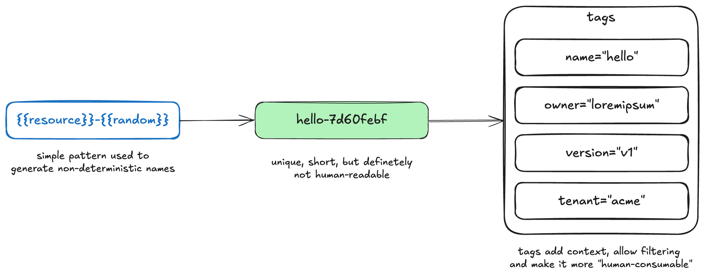

Most of us have to name “things” daily: variables, functions, services, cloud resources and others. Most are easy to change due to refactoring tools, but cloud resources can be impossible. Most vendors require full resource replacement: renaming a database leads to restore/recreate, and a load balancer requires shifting live traffic to a new instance. **I will cover how to avoid major complications by simply re-thinking how you name cloud resources** and (hopefully) avoid renames.

## **Could a naming strategy help?**

Since names are hard to change, teams might settle on a strategy that provides unique names, human-readable format so filtering/finding it is easy, and makes it simple to parse with automation, to name a few. **But naming strategies are generally not good** and you will see why.

Standardised names will follow a pattern that allows “context” around that resource, defined by indicators that exist (eg, type or environment) or might exist in the future (eg, tenant or version). For example, consider a `hello` service needs a Postgres in AWS (RDS), these could be potential names:

- `{{res}}_{{name}}_{{region}}` ⇒ `db_hello_eu-west-1`… but what if it needs other types of databases later (eg, ElasticSearch) and a second instance for an upgrade?
- `{{cloud_res}}_{{name}}_{{version}}_{{region}}` ⇒ `rds_hello_v1_eu-west-1`… but what happens if we have to indicate the many environments and a potential second cloud provider?
- `{{vendor}}_{{env}}_{{cloud_res}}_{{name}}_{{version}}_{{region}}` ⇒  `aws_dev_postgres_hello_v1_eu-west-1`… and so on

There might be even more variations depending on what indicators are desirable. Extra indicators are favoured to give full context around the resource but it usually backfires, since they become quite long and confusing due to the amount of information in them.

Also, the last example is already quite long (45 characters) and it could be even longer.  Cloud vendors or platforms have character limits (eg, AWS S3 ⇒ 63 characters) and it wouldn't be too hard to hit them due varying indicators (eg, `dev` ⇒ `production`: \+7 characters).

Besides the concerns above, the initial problem still holds: **renaming is hard**. **Naming strategies are fragile since it is hard to predict future changes** (eg, extra indicators). Not only, if more indicators are required, the strategy will be broken and a `v2` will be needed, leaving an organised mess behind.

## **Non-deterministic names**

The world would be a better place if those strategies were only name \+ suffix (date or version), such as `hello_v1`, but that is not the case.

But, what if the `<name>-<suffix>` pattern was replaced with `<resource>-<hash>`, resulting in names that look more like IDs (`rds-7d60febf` or `vpc-57444099`)? **It sounds crazy, but since non-deterministic names behave like IDs, they should never need renaming, solving our initial problem.**

These names, although solving uniqueness, wouldn't give any indication how `rds-7d60febf` relates to `hello`, for example. This is because there are better alternatives to provide extra context without bloating the name.

To begin with, indicators such as region and vendor are pretty much unique to a resource already. Even the environment might be (eg, each environment has its own account). These are most likely already exported in logs or traces, and search and reporting tools will likely allow filtering by those.

But how would someone know that `rds-7d60febf` is the `hello`'s database? The answer is tagging.

## **Tagging for filtering**

Tags are key/value metadata that can be attached to resources in cloud vendors. Compared to names, they are generally mutable, solving our concerns around future renames.

**Teams can implement a tagging strategy with a common set of required tags that give enough information about a certain resource**. Information such as `name`, `owner`, `version` and `environment` can be added and leveraged for filtering. They are not only useful to find resources in the console, but also to support operations (logs, traces, automation), billing management, data security and risk management.

Different from names, detecting resources that are non-conformant to the tagging strategy is easier. This is because compliance can be enforced via policies. When updating resources, the policy will trigger, requiring an engineer to adjust it and add at least a few common tags.

You might still be thinking though: `rds-7d60febf` wouldn't be a very friendly name to look at in the console. Hence why some cloud providers have special tags to allow a “display name” in the Console (AWS: `tag:Name`). Since they are generally mutable, engineers can apply some standardisation on them and change as required.

ℹ️ Even if you don't want to embrace non-deterministic naming, tags are still quite powerful and I strongly recommend any company to understand how to best use them and implement a basic strategy. AWS has a good guide around [tagging strategy](https://docs.aws.amazon.com/whitepapers/latest/tagging-best-practices/building-your-tagging-strategy.html) and [tagging use cases](https://docs.aws.amazon.com/whitepapers/latest/tagging-best-practices/tagging-use-cases.html).

## **Referencing for IaC**

Previously, a shared naming module could generate the same name elsewhere based on the same unique indicators from the naming strategy. This is not an option anymore and copying the name around is not great, since they are not easily identifiable. How can it be referenced around though?

Most IaC tools have input and output mechanisms. `hello` stack likely would output the generated name, and this could be used as an input in another stack.

On Terraform, the good old `terraform_remote_state` can be used, where users can reference the outputs of a remote state/stack (`hello`). But, there will be a higher coupling to this remote state, which is the reason some use shared naming packages paired with `data` resources instead, and stacks referencing it might not automatically get updated states and drift.

If you use an IaC platform to manage your infrastructure, you might be able to define dependencies between stacks and, when a stack is triggered and its output changes, downstream dependencies will receive the values via `variable` inputs and trigger a reconciliation (eg, HashiCorp [Linked Stacks](https://www.hashicorp.com/en/blog/new-in-hcp-terraform-linked-stacks-enhanced-tags-and-module-lifecycle-management), Spacelift [Stack Dependencies](https://docs.spacelift.io/concepts/stack/stack-dependencies), Crossplane). **In this case, the `name` of the resource is just passed around, without users having to actively think about it.** Users can either use it directly or pull more details using `data` objects.

**Just don't feel tempted to use `data` solely through tags.** Tags can change over time and it might break your infrastructure in the future. An example would be a tag removal or update from the source that causes dependencies to not be able to retrieve it anymore.

## **Conclusion**

If the company already has an existing naming strategy, moving away from it or implementing in tandem might not be easy. **For new projects though, I would recommend considering non-deterministic names paired with a strong tagging strategy.**

Ideally, teams must have tools to link stacks and keep outputs (such as generated names) synced with downstream dependencies, and as well tags must be exported anywhere engineers might need to filter results for specific resources (billing/observability platforms). Without these two, using non-deterministic names can be painful since there is a higher cognitive load, such as manual copy/pastes for IaC and a mapping of what each resource name identifies when searching for it.
