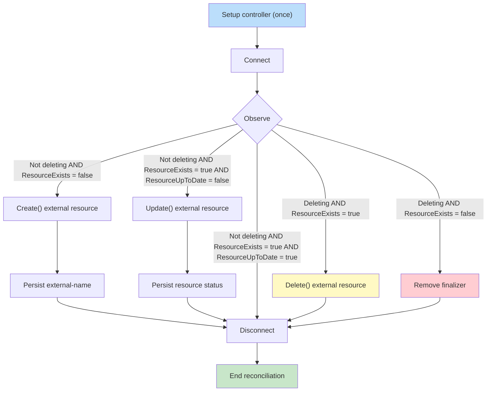

## Introduction

Kubernetes is popular for workload orchestration, but its controller pattern is what makes it extensible. Every CRD relies on that pattern. Implementing one yourself requires code to manage a resource's lifecycle. Crossplane lets teams define their own CRDs without writing the controllers themselves.

Crossplane does this through compositions and providers. Compositions are similar to Terraform modules and are usually defined in YAML, although they can also use Go. Providers are controllers for Crossplane managed resources, similar to Terraform providers. They manage the lifecycle of a specific object, such as creating, updating, and deleting a bucket.

Most of the time you will either use an official provider or leverage upjet (generate from Terraform), but sometimes you will need to implement your own.

## Why create your own provider?

In most cases, you will be able to find an official provider (AWS/GCP) that is decent and well maintained, but many times you won't since Crossplane still does not have as much coverage as Terraform. Hence, there are two options: generate a provider using [upjet](https://github.com/crossplane/upjet) or implement a provider yourself.

[Upjet](https://github.com/crossplane/upjet) leverages the Terraform ecosystem and it generates providers that hook to its providers. In many cases this is enough, especially for well maintained Terraform providers. Many of the official Upbound and Crossplane providers use it and it is the quickest way to implement a custom provider. But, there are a few caveats:

1. Not all vendors will have a proper Terraform provider, if they have one at all
2. Some Terraform providers might be incompatible with Upjet
3. Teams might want to have custom logic between reconciliation logic (e.g. emit specific metrics)
4. Generated providers can be slow or memory-intensive when Terraform overhead is a poor fit

If you hit one of the above, you are left with implementing a provider from scratch.

## Start with the provider template

Don't panic: you won't start fully from scratch. The Crossplane team maintains a [provider template](https://github.com/crossplane/provider-template), which is a good starting point for most providers and also they maintain very popular providers you can base yourself on.

The template gives you the repository structure, build tooling and scaffolding utils (e.g. `make provider.addtype`). All generated types will be placed in `internal/controller/{}` and those will define the reconciliation hooks described in the next section ([example](https://github.com/crossplane/provider-template/tree/main/internal/controller/mytype)). The provider's behavior comes from how those hooks interact with the external API.

## Implementing the Crossplane reconcile loop

<sub><sub>ℹ️ The following consider [default management policies](https://github.com/crossplane/crossplane-runtime/blob/5092c39e4b0099816912dc7d07b2a670a0dba9dc/pkg/reconciler/managed/api.go#L48-L61) being in place, as otherwise they change the lifecycle behaviour.<sub><sub>

Crossplane providers use the controller pattern through a managed reconciler abstraction. Instead of a single `Reconcile` function, provider controllers implement a strict interface with several hooks. The Crossplane runtime manages their lifecycle, ordering, and state, handling work that a controller built with Kubebuilder would otherwise need to implement (and probably lose some hair when bugs end up surfacing).

### Lifecycle hooks in a nutshell

`Setup` runs once to register the controller for a "managed-resource" kind. After that, for each reconciliation the runtime calls `Connect`, `Observe`, and then `Create`, `Update`, or `Delete` when needed before calling `Disconnect`.

Besides these specific hooks in the reconcile loop, Crossplane leverages annotations to keep track of reconciliation state. The most important one is [`crossplane.io/external-name`](http://crossplane.io/external-name), which identifies the underlying resource via a stable lookup key (e.g. ID, ARN, or resource path):

- Before `Connect` and `Observe`, the [managed reconciler's default initializer](https://github.com/crossplane/crossplane-runtime/blob/5092c39e4b0099816912dc7d07b2a670a0dba9dc/pkg/reconciler/managed/api.go#L48-L61) persists `metadata.name` as the external name when the annotation is absent. Providers overwrite it during `Create` only when the external system returns a different stable lookup key.
- Users can pre-populate it to identify and import an existing resource, although it should be used together with an `Observe` management policy (beta feature) to prevent unintended changes ([docs about Crossplane resource import](https://docs.crossplane.io/v2.3/guides/import-existing-resources/)).

If [management policies are to the `*` (default)](https://docs.crossplane.io/v2.3/managed-resources/managed-resources/#managementpolicies), where no hook is excluded, the provider lifecycle can be summarised as:



### Setup registers controller dependencies

This function runs once during provider setup and configures `controller-runtime` for the resource. It is also the right place to add a few shared dependencies:

1. Inject the `controller.Options Logger` in the `connector` being created, since it is better to use the same logger used by the controller, with the same fields set by it
2. In case opening a connection to your vendor can be expensive / slow, you might want to implement and inject a connection pool map at this stage. An example is a provider that connects to databases and lazily starts a connection at `Connect`, adds to this pool, and re-uses across reconciles, instead of always terminating it at `Disconnect`. **Bear in mind this is in general an optimisation and not always required** since it adds extra complexity (e.g. configuring connections timeouts).

```go
func Setup(mgr ctrl.Manager, o controller.Options) error {
	r := managed.NewReconciler(
		mgr,
		resource.ManagedKind(v1alpha1.UserGroupVersionKind),
		managed.WithTypedExternalConnector[*v1alpha1.User](&connector{}),
	)

  // Setup other flags and controller options
  // ...

	return ctrl.NewControllerManagedBy(mgr).
		For(&v1alpha1.User{}).
		Complete(r)
}
```

| Repository | References |
| :--------- | :--------- |
| `provider-template` | [Setup and reconciler wiring](https://github.com/crossplane/provider-template/blob/328a8a692f06a0306ffe7623463560fd3633a643/internal/controller/mytype/mytype.go#L58-L110) |

### Connect: create your clients

This is the first function called on the reconciliation loop ([example](https://github.com/crossplane/provider-template/blob/328a8a692f06a0306ffe7623463560fd3633a643/internal/controller/mytype/mytype.go#L120-L162)). Since all further hooks will need a client to be set up, **the provider must set it up at this stage and keep a reference in the generated `external` instance.**

- The provider should read `ProviderConfig` to configure authentication and other client settings. In Crossplane v2, `ProviderConfig` can be cluster or namespace-scoped, so be aware you might need to specify a logic to read the correct one ([provider-template](https://github.com/crossplane/provider-template/blob/main/internal/controller/mytype/mytype.go#L132-L149) has examples of it).
- Clients most likely will require credentials on method calls. A custom middleware (e.g. HTTP Transport, gRPC interceptor) can set the required authorization details and avoid duplicating that work at each call site, requiring only injecting those.

```go
func (c *connector) Connect(
	ctx context.Context,
	cr *v1alpha1.User,
) (managed.TypedExternalClient[*v1alpha1.User], error) {
	// Read `ProviderConfig` and create the vendor client. It may be an HTTP
	// client, database connection, or CLI wrapper. It lives for this
	// reconciliation unless the provider implements connection pooling.
	client, err := newClient(ctx, cr)
	if err != nil {
		return nil, fmt.Errorf("create client during connect: %w", err)
	}

	return &external{client: client}, nil
}
```

Paired with `Connect`, implement `Disconnect` to close resources that need closing. It can be a no-op for reusable clients such as `http.Client`, but might be required in cases of database connections (depending on how they are managed).

```go
func (c *external) Disconnect(context.Context) error {
	// Close a per-reconciliation client here, if it has resources to release.
	return nil
}
```

| Repository | References |
| :--------- | :--------- |
| `crossplane-runtime` | [Connect/Disconnect core reference](https://github.com/crossplane/crossplane-runtime/blob/5092c39e4b0099816912dc7d07b2a670a0dba9dc/pkg/reconciler/managed/reconciler.go#L1145-L1176) |
| `provider-template` | [Code reference](https://github.com/crossplane/provider-template/blob/328a8a692f06a0306ffe7623463560fd3633a643/internal/controller/mytype/mytype.go#L120-L162) |

### Observe: the provider's "brain"

This is one of the most important hooks since it defines what will (or not) be called next. It fetches the resource through the `crossplane.io/external-name` annotation and then:

1. The default managed reconciler initializes the annotation from `metadata.name`, so `Observe` normally queries the vendor with a non-empty external name. A vendor “not found” response triggers `Create` by returning `ResourceExists: false`.
2. If it exists, it should always update the status of the MR (it is done via pointer when `cr.Status.AtProvider` is set) and the return must always have `ResourceExists: true`. The last part depends if the observed status matches the managed resource's desired state in `spec.forProvider`:
    1. If it matches, no action is required and it must return `ResourceUpToDate: true` + set it to available
    2. If does not, it must trigger an `Update` by returning `ResourceUpToDate: false`

The example below assumes the vendor adapter exposes `Get`, `Create`, `Update`, and `Delete`, and that `isNotFound` recognizes its not-found response.

```go
func (c *external) Observe(
	ctx context.Context,
	cr *v1alpha1.User,
) (managed.ExternalObservation, error) {
	observed, err := c.client.Get(ctx, meta.GetExternalName(cr))
	if isNotFound(err) {
		return managed.ExternalObservation{ResourceExists: false}, nil
	}
	if err != nil {
		return managed.ExternalObservation{}, fmt.Errorf("get resource: %w", err)
	}

	// Update managed-resource status from the observed state. Extract this to
	// updateStatus once it spans several fields.
	cr.Status.AtProvider.Name = observed.Name

	// Compare observed and desired state. Extract this to isUpToDate when
	// several fields must be compared.
	upToDate := cr.Spec.ForProvider.Name == observed.Name
	if upToDate {
		cr.Status.SetConditions(xpv1.Available())
	}

	return managed.ExternalObservation{
		ResourceExists:   true,
		ResourceUpToDate: upToDate,
	}, nil
}
```

| Repository | References |
| :--------- | :--------- |
| `crossplane-runtime` | [Update core reference](https://github.com/crossplane/crossplane-runtime/blob/5092c39e4b0099816912dc7d07b2a670a0dba9dc/pkg/reconciler/managed/reconciler.go#L1178-L1196) |
| `provider-template` | [Code reference](https://github.com/crossplane/provider-template/blob/328a8a692f06a0306ffe7623463560fd3633a643/internal/controller/mytype/mytype.go#L172-L218) |

### Create: resource creation and `external-name` setting

`Create` is called after `Observe` returns `ResourceExists: false`. It creates the resource in the external system and sets `external-name` if it assigns an identifier (e.g. ID). The managed reconciler persists annotation changes made in this hook, but discards status changes. Because of the latter, do not implement `cr.Status.AtProvider` mutations in `Create` and populate status during the next `Observe` instead. Connection details are separate from status: return them in `managed.ExternalCreation` and the reconciler publishes them to the configured connection store.

```go
func (c *external) Create(
	ctx context.Context,
	cr *v1alpha1.User,
) (managed.ExternalCreation, error) {
	// Convert the managed-resource spec to a vendor request.
	req := toCreateRequest(cr.Spec.ForProvider)
	created, err := c.client.Create(ctx, req)
	if err != nil {
		return managed.ExternalCreation{}, fmt.Errorf("create resource: %w", err)
	}

	// Create persists annotations, but not status. Observe hydrates status later.
	meta.SetExternalName(cr, created.ID)
	return managed.ExternalCreation{
		ConnectionDetails: managed.ConnectionDetails{
			"url": []byte(created.URL),
		},
	}, nil
}
```

| Repository | References |
| :--------- | :--------- |
| `crossplane-runtime` | [Create core reference](https://github.com/crossplane/crossplane-runtime/blob/5092c39e4b0099816912dc7d07b2a670a0dba9dc/pkg/reconciler/managed/reconciler.go#L1349-L1471) |
| `provider-template` | [Code reference](https://github.com/crossplane/provider-template/blob/main/internal/controller/mytype/mytype.go#L220-L230) |

### Update: resource update and status refresh

`Update` is called after `Observe` returns `ResourceExists: true` and `ResourceUpToDate: false`. It changes the external resource to match `spec.forProvider`. Unlike `Create`, the reconciler persists status changes made by `Update`, so it can refresh `cr.Status.AtProvider` and conditions. Do not mutate annotations in this hook, because they are not persisted. A subsequent `Observe` should confirm that the resource is now up to date.

```go
func (c *external) Update(
	ctx context.Context,
	cr *v1alpha1.User,
) (managed.ExternalUpdate, error) {
	// Convert the managed-resource spec to a vendor request.
	req := toUpdateRequest(cr.Spec.ForProvider)
	updated, err := c.client.Update(ctx, meta.GetExternalName(cr), req)
	if err != nil {
		return managed.ExternalUpdate{}, fmt.Errorf("update resource: %w", err)
	}

	// Update persists status, unlike Create.
	cr.Status.AtProvider.Name = updated.Name
	return managed.ExternalUpdate{}, nil
}
```

| Repository | References |
| :--------- | :--------- |
| `crossplane-runtime` | [Update core reference](https://github.com/crossplane/crossplane-runtime/blob/5092c39e4b0099816912dc7d07b2a670a0dba9dc/pkg/reconciler/managed/reconciler.go#L1515-L1571) |
| `provider-template` | [Code reference](https://github.com/crossplane/provider-template/blob/main/internal/controller/mytype/mytype.go#L232-L247) |

### Delete: ensuring resource is gone

`Delete` calls the external delete API after `Observe` reports that a deleting managed resource still exists externally. On a later reconciliation, `Observe` reports `ResourceExists: false` and, together with [`meta.WasDeleted() == true`](https://github.com/crossplane/crossplane-runtime/blob/5092c39e4b0099816912dc7d07b2a670a0dba9dc/pkg/reconciler/managed/reconciler.go#L1235-L1236), the runtime removes its finaliser. If the external resource remains, it keeps retrying deletion until the resource ceases to exist.

```go
func (c *external) Delete(
	ctx context.Context,
	cr *v1alpha1.User,
) (managed.ExternalDelete, error) {
	externalName := meta.GetExternalName(cr)
	if externalName == "" {
		return managed.ExternalDelete{}, nil
	}

	err := c.client.Delete(ctx, externalName)
	if err != nil && !isNotFound(err) {
		return managed.ExternalDelete{}, fmt.Errorf("delete resource: %w", err)
	}

	return managed.ExternalDelete{}, nil
}
```

| Repository | References |
| :--------- | :--------- |
| `crossplane-runtime` | [Delete core reference](https://github.com/crossplane/crossplane-runtime/blob/5092c39e4b0099816912dc7d07b2a670a0dba9dc/pkg/reconciler/managed/reconciler.go#L1225-L1316) |
| `provider-template` | [Code reference](https://github.com/crossplane/provider-template/blob/328a8a692f06a0306ffe7623463560fd3633a643/internal/controller/mytype/mytype.go#L249-L255) |

## Provider design choices that prevent reconciliation bugs

### Put connection defaults in `ProviderConfig`

Store connection-level details such as credentials, API endpoints, account or cluster identifiers, and default regions in `ProviderConfig`. This avoids repeating the same values across multiple resources and keeps your APIs cleaner. `spec.forProvider` should be for fields that represent the desired state of a resource (e.g. database name, size, or network). If multiple resources using the same credentials could have different values, it belongs in the resource spec — not the `ProviderConfig`.

### Treat `crossplane.io/external-name` as a stable lookup key

Use `external-name` as the stable key your provider uses to look up an external resource. The managed reconciler defaults it to `metadata.name`, but providers must overwrite it during `Create` when the external system returns a different name, such as an ID. Pre-populating the annotation also enables importing existing infrastructure, as previously mentioned.

### Classify vendor errors before returning an observation

Return `ResourceExists: false` only for a vendor not-found response. Authentication, authorization, throttling, timeout, and malformed-response errors must be detected and returned as errors (usually dealt with in an adapter layer). Reporting any of those as an absent resource can make Crossplane create a duplicate resource.

### Let Crossplane persist state and minimise Kube client calls

Your external client logic should focus on reconciling the external system, not persisting changes to the managed resource. Crossplane’s managed reconciler already handles lifecycle concerns such as updating status, managing finalizers, and persisting annotations. Calling the Kubernetes API to mutate the managed resource from an external client can lead to race conditions, conflicts, and harder-to-maintain code. Instead, return the appropriate observation or update results and let Crossplane handle the rest.

Using the Kubernetes client in `Connect` to read the referenced `ProviderConfig` and credentials Secret is expected. When you need other Kubernetes resources, first check whether Crossplane provides an abstraction. For example, use `ProviderConfig` secret references for credentials rather than defining a separate secret-management mechanism.

### Share logic between namespaced and cluster-scoped resources

Crossplane V2 allows cluster and namespaced resources. If you support both, avoid duplicating reconciliation logic. The external API interactions (observe, create, update, delete) are usually identical regardless of scope. Share this logic across controllers and only introduce separate implementations when there is a real difference in behavior or a compatibility requirement. This reduces maintenance overhead and keeps your provider easier to evolve and test.

## Start building a provider

Hopefully you now have a good understanding of how providers work and are implemented. Start with the [Crossplane provider template](https://github.com/crossplane/provider-template), and use providers such as [`provider-opentofu`](https://github.com/upbound/provider-opentofu), [`provider-http`](https://github.com/crossplane-contrib/provider-http) and my own [crossplane-demo acme provider](https://github.com/brunoluiz/crossplane-demo/tree/main/provider-acme) for a working reference.

If a vendor API makes idempotency, imports, or asynchronous operations awkward, document those constraints before writing the controller. They will shape the provider's API and reconciliation behavior more than its Go code will.
