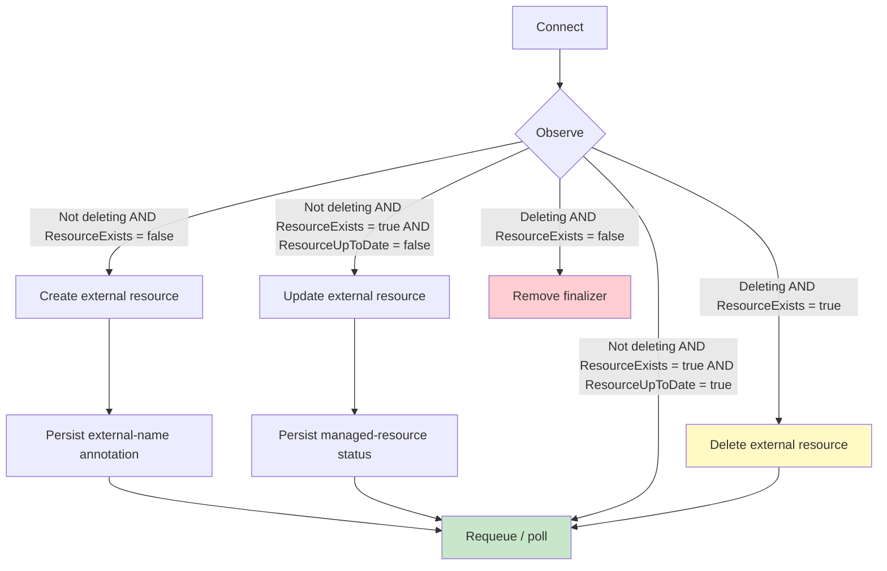

## Introduction

Kubernetes might be popular for its workload orchestration, but it really shines in how easily extendable it is via the controller pattern. Every time you install a CRD, you are essentially leveraging it. The problem is that it requires teams to create plenty of code to manage the lifecycle of a resource. Crossplane allows teams to write their own CRDs without having to write controllers (sort of).

This is possible via compositions and providers, where compositions are similar to Terraform modules and defined primarily using YAML (although some use Golang), and providers are essentially controllers for the Crossplane managed resources (similar to Terraform providers). They are responsible for managing the lifecycle of a specific object, such as “create, update and delete” a Bucket.

Most of the time you will either use an official provider or leverage upjet (generate from Terraform), but sometimes you will need to implement your own.

## Why create your own provider?

In most cases, you will be able to find an official provider (AWS/GCP) and, but sometimes you won't. There are two options: generate a provider using upjet or implement a provider yourself.

Upjet leverages the Terraform ecosystem and it generates providers that hook to it. In many cases this is enough, especially for well maintained Terraform providers. Many of the official Upbound and Crossplane providers use it and it is the quickest way to implement a custom provider. But, there are a few caveats:

1. Not all vendors will have a proper Terraform provider
2. Some Terraform providers might prove incompatible with Upjet
3. Teams might want to have custom logic between reconciliation logic (eg: emit specific metrics)
4. Upjet performance can be poor, resulting in delayed reconcile loops or OOMs

If you hit one of the above, you are left with implementing a provider from scratch. Before that, you must know how providers work.

## The Crossplane reconcile loop

Since Crossplane follows the controller pattern, a provider essentially implements the reconciliation loop, but with its own abstraction.

Instead of requiring a simple “reconcile” function, provider controllers must implement a strict interface with a few hooks, making it almost an “integration” framework. The lifecycle, order and state is managed by the Crossplane runtime, abstracting complexities that would generally need to be implemented using tools such as kubebuilder. Although, **I highly recommend engineers to go at least once through the managed reconciler controller,** since when troubleshooting something that will have most answers.

Besides the specific hooks in the reconcile loop, Crossplane uses annotations to keep track of reconciliation state. A very important one is [`crossplane.io/external-name`](http://crossplane.io/external-name), which identifies the underlying resource. The runtime initializes a missing external name from `metadata.name`; providers should set it during `Create` when the external system assigns a different identifier. Users can pre-populate it to identify an existing resource, but should first import it with an [`Observe` management policy](https://docs.crossplane.io/v2.3/guides/import-existing-resources/) to prevent unintended changes.

A provider lifecycle follows these steps:

1. **Setup:** registers a controller for one managed-resource kind. It runs outside the reconciliation loop and is the right place to construct shared dependencies, such as a connector. The managed resource and its `ProviderConfig` are available only later, in `Connect`.
2. **Connect:** sets up the client or other dependencies required by the remaining lifecycle steps. It runs once per reconciliation and returns the `external` instance that owns the client.
3. **Observe:** queries the third-party API, usually using [`crossplane.io/external-name`](http://crossplane.io/external-name), and returns `ResourceExists` and `ResourceUpToDate`. A vendor "not found" response returns `ResourceExists: false`; a real API error must be returned as an error. If the resource exists, `Observe` hydrates `status.atProvider` and compares the observed resource with `spec.forProvider` to decide whether it is up to date.
4. **Create:** runs when `Observe` returns `ResourceExists: false`. It creates the external resource and sets `external-name` when the provider learns an externally assigned identifier. The reconciler persists annotation changes made by `Create`, but discards status changes, so a later `Observe` hydrates the resource status.
5. **Update:** runs when `Observe` returns `ResourceExists: true` and `ResourceUpToDate: false`. It updates the external resource to match the desired state. The reconciler persists status changes made by `Update`, but not changes to annotations or spec fields. The next `Observe` confirms that the external resource is up to date.
6. **Delete:** when the managed resource is being deleted, `Observe` still runs first. If it returns `ResourceExists: true`, the reconciler calls `Delete` and retries until `Observe` reports the resource absent. When `Observe` returns `ResourceExists: false`, the reconciler removes its finalizer in the same reconciliation.
7. **Disconnect:** runs at the end of every reconciliation. It can be a no-op for reusable clients such as `http.Client`; use it to close resources with a per-reconciliation lifecycle, such as an ephemeral database session.

## Anatomy of a provider repository

## Implementation

### Scaffolding

So you are ready to start implementing your custom provider? The Crossplane team maintains a [provider template](https://github.com/crossplane/provider-template), which is a good starting point for most. The README has most instructions on how to set it up and create your first controller with `make provider.addtype`.

Once you generate your type with `make provider.addtype`, you will get a `internal/controller/{}` which is what defines the aforementioned reconciliation hooks ([example](https://github.com/crossplane/provider-template/tree/main/internal/controller/mytype)).

### Setup

This function is called once on the provider setup and will mostly configure the `controller-runtime` for this specific resource. In general it is *“boilerplatey”*, but I suggest to add a few things here:

1. Inject the `controller.Options Logger` in the `connector` being created, since it is better to use the same logger used by the controller, with the same fields set by it
2. In case opening a connection to your vendor can be expensive / slow, you might want to implement and inject a connection pool map at this stage. An example is a provider that connects to databases and lazily starts a connection at `Connect`, adds to this pool, and re-uses across reconciles, instead of always terminating it at `Disconnect`. **Bear in mind this is in general an optimisation and not always required** since it adds extra complexity (eg: configuring connections timeouts).

### Connect / Disconnect

This is the first function called on the reconciliation loop ([example](https://github.com/crossplane/provider-template/blob/328a8a692f06a0306ffe7623463560fd3633a643/internal/controller/mytype/mytype.go#L120-L162)). Since all further hooks will need a client to be set up, **the provider must set it up at this stage and keep a reference in the generated `external` instance.**

The provider should read the `ProviderConfig` to wire up the auth and other bits for the client setup. Bear in mind that in Crossplane v2 this can be at cluster or namespace level.

One thing to note is that some SDKs / clients might require credential injection on every method call (eg: OpenAPI generated). Since they have HTTP Clients underneath, my recommendation is to create a custom HTTP Transport that sets the required auth headers, avoiding further boilerplate.

Paired with `Connect`, implement `Disconnect` to close resources that need closing. It can be a no-op for reusable clients such as `http.Client`, but might be required in cases of database connections (depending on how they are managed).

| Repository | References |
| :--------- | :--------- |
| `crossplane-runtime` | [Connect/Disconnect core reference](https://github.com/crossplane/crossplane-runtime/blob/5092c39e4b0099816912dc7d07b2a670a0dba9dc/pkg/reconciler/managed/reconciler.go#L1145-L1176) |
| `provider-template` | [Code reference](https://github.com/crossplane/provider-template/blob/328a8a692f06a0306ffe7623463560fd3633a643/internal/controller/mytype/mytype.go#L120-L162) |

### Observe

This is one of the most important hooks since it defines what will (or not) be called next. It tries to fetch the resource via through the [`crossplane.io/external-name`](http://crossplane.io/external-name) resource annotation and then:

1. If the annotation does not exist, is empty or the the vendor returns “not found”, it triggers `Create` by returning `ResourceExists: false`
2. If it exists, it should always update the status of the MR (it is done via pointer when `cr.Status.AtProvider` is set) and the return must always have `ResourceExists: true`. The last part depends if the observed status matches the managed resource's desired state in `spec.forProvider`:
   1. If it matches, this is effectively an import and the it must return `ResourceUpToDate: true` and set it to available
   2. If does not, it must trigger an `Update` by returning `ResourceUpToDate: false`

| Repository | References |
| :--------- | :--------- |
| `crossplane-runtime` | [Update core reference](https://github.com/crossplane/crossplane-runtime/blob/5092c39e4b0099816912dc7d07b2a670a0dba9dc/pkg/reconciler/managed/reconciler.go#L1178-L1196) |
| `provider-template` | [Code reference](https://github.com/crossplane/provider-template/blob/328a8a692f06a0306ffe7623463560fd3633a643/internal/controller/mytype/mytype.go#L172-L218) |

### Create

`Create` is called after `Observe` returns `ResourceExists: false`. It creates the resource in the third-party system and sets `external-name` if the third-party assigns its identifier. The managed reconciler persists annotation changes made in this hook, but discards status changes. Do not rely on `cr.Status.AtProvider` mutations in `Create`; populate status during the next `Observe` instead.

| Repository | References |
| :--------- | :--------- |
| `crossplane-runtime` | [Create core reference](https://github.com/crossplane/crossplane-runtime/blob/5092c39e4b0099816912dc7d07b2a670a0dba9dc/pkg/reconciler/managed/reconciler.go#L1349-L1471) |
| `provider-template` | [Code reference](https://github.com/crossplane/provider-template/blob/main/internal/controller/mytype/mytype.go#L220-L230) |

### Update

`Update` is called after `Observe` returns `ResourceExists: true` and `ResourceUpToDate: false`. It changes the external resource to match `spec.forProvider`. Unlike `Create`, the reconciler persists status changes made by `Update`, so it can refresh `cr.Status.AtProvider` and conditions. Do not mutate annotations or spec fields in this hook, because they are not persisted. A subsequent `Observe` should confirm that the resource is now up to date.

| Repository | References |
| :--------- | :--------- |
| `crossplane-runtime` | [Update core reference](https://github.com/crossplane/crossplane-runtime/blob/5092c39e4b0099816912dc7d07b2a670a0dba9dc/pkg/reconciler/managed/reconciler.go#L1515-L1571) |
| `provider-template` | [Code reference](https://github.com/crossplane/provider-template/blob/main/internal/controller/mytype/mytype.go#L232-L247) |

### Delete

`Delete` calls the third-party delete API after `Observe` reports that a deleting managed resource still exists externally. On a later reconciliation, `Observe` reports `ResourceExists: false`; together with [`meta.WasDeleted() == true`](https://github.com/crossplane/crossplane-runtime/blob/5092c39e4b0099816912dc7d07b2a670a0dba9dc/pkg/reconciler/managed/reconciler.go#L1235-L1236), the runtime removes its finalizer. If the external resource remains, it keeps retrying deletion until the resource ceases to exist.

| Repository | References |
| :--------- | :--------- |
| `crossplane-runtime` | [Delete core reference](https://github.com/crossplane/crossplane-runtime/blob/5092c39e4b0099816912dc7d07b2a670a0dba9dc/pkg/reconciler/managed/reconciler.go#L1225-L1316) |
| `provider-template` | [Code reference](https://github.com/crossplane/provider-template/blob/328a8a692f06a0306ffe7623463560fd3633a643/internal/controller/mytype/mytype.go#L249-L255) |

## Asynchronous and safe creation

The same hooks work with asynchronous APIs, but `Create`, `Update`, and `Delete` must start work or check its progress rather than wait for a long-running vendor operation to complete. Always pass the reconciliation context to the vendor SDK and configure bounded request timeouts. Do not start an unbounded goroutine to wait for a hanging request: it ignores cancellation and makes retries harder to reason about.

After the vendor accepts a create request, persist a stable lookup identity. Use `crossplane.io/external-name` when it identifies the target resource; otherwise, store an operation ID in a provider-specific annotation. `Create` cannot persist `status` changes, so storing an operation ID in `status.atProvider` from that hook loses it. `Observe` uses the stable identity to poll the resource or operation and hydrate status once it is available.

While provisioning is in progress, `Observe` must not report `ResourceExists: false` solely because the target resource is not ready yet: that would invoke `Create` again. Once the vendor has accepted the request, report an existing external state and use `ResourceUpToDate` to reflect whether the resource has reached the desired state. `Update` must tolerate being called while the operation is still in progress. Set `ResourceLateInitialized` only when `Observe` fills previously unset `spec` defaults; it is unrelated to operation status or annotations.

### Make ambiguous creates safe

A request timeout is not proof that the vendor rejected the request. The vendor might have accepted the POST and created the resource, while its response was lost. Retrying that request with a new random identity can leak a duplicate resource. Make retries converge on the same resource using one of these patterns:

1. Send a vendor-supported idempotency key derived from a stable managed-resource identity, such as its UID.
2. Choose a deterministic vendor name or ID, use it as the external name, and look it up before retrying.
3. Attach a stable unique tag or label to the create request, then search for it before issuing another POST.

Treat an existing resource with the same key, ID, or tag as successful convergence, not as an error. If the vendor assigns a random ID and provides neither an idempotency key nor a reliable lookup mechanism, the provider cannot safely guarantee that an ambiguous create will not duplicate resources.

The managed reconciler records `external-create-pending` before it calls `Create`, then records success or failure afterward. If the provider crashes after the pending marker but before recording an outcome, Crossplane stops rather than risk creating another resource. These annotations detect an unknown outcome; they do not deduplicate requests in the vendor API.

| Repository | References |
| :--------- | :--------- |
| `crossplane-runtime` | [External client contract](https://github.com/crossplane/crossplane-runtime/blob/5092c39e4b0099816912dc7d07b2a670a0dba9dc/pkg/reconciler/managed/reconciler.go#L290-L331)   [Create safety and annotations](https://github.com/crossplane/crossplane-runtime/blob/5092c39e4b0099816912dc7d07b2a670a0dba9dc/pkg/reconciler/managed/reconciler.go#L1100-L1119)   [Create core reference](https://github.com/crossplane/crossplane-runtime/blob/5092c39e4b0099816912dc7d07b2a670a0dba9dc/pkg/reconciler/managed/reconciler.go#L1349-L1471) |

## Provider design choices that prevent reconciliation bugs

### Put connection defaults in `ProviderConfig`

Store connection-level details such as credentials, API endpoints, account or cluster identifiers, and default regions in `ProviderConfig`. This avoids repeating the same values across multiple resources and keeps your APIs cleaner. `spec.forProvider` should be for fields that represent the desired state of a resource resource (e.g. database name, size, or network). If multiple resources using the same credentials could have different values, it belongs in the resource spec — not the `ProviderConfig`.

### Treat `crossplane.io/external-name` as the source of truth

Always set the `external-name` annotation to the identifier used by the external system (e.g. ID, ARN, or resource path). This ensures your provider can reliably observe, update, and delete the resource. It also enables importing existing infrastructure by pre-populating the annotation. Avoid assuming the Kubernetes `metadata.name` matches the external name, since most of the time they won't.

### Let Crossplane persist managed-resource state

Your external client logic should focus on reconciling the external system, not persisting changes to the managed resource. Crossplane’s managed reconciler already handles lifecycle concerns such as updating status, managing finalizers, and persisting annotations. Calling the Kubernetes API to mutate the managed resource from an external client can lead to race conditions, conflicts, and harder-to-maintain code. Instead, return the appropriate observation or update results and let Crossplane handle the rest.

Using the Kubernetes client in `Connect` to read the referenced `ProviderConfig` and credentials Secret is expected. When you need other Kubernetes resources, first check whether Crossplane provides an abstraction. For example, use `ProviderConfig` secret references for credentials rather than defining a separate secret-management mechanism.

### Share logic between namespaced and cluster-scoped resources

Crossplane V2 allows cluster and namespaced resources. If you support both, avoid duplicating reconciliation logic. The external API interactions (observe, create, update, delete) are usually identical regardless of scope. Share this logic across controllers and only introduce separate implementations when there is a real difference in behavior or a compatibility requirement. This reduces maintenance overhead and keeps your provider easier to evolve and test.

## Start building a provider

Start with the [Crossplane provider template](https://github.com/crossplane/provider-template), then use [crossplane-demo](https://github.com/brunoluiz/crossplane-demo) alongside the [Container Days presentation](https://www.linkedin.com/feed/update/urn:li:activity:7428027963859755008/) for a working reference.

If a vendor API makes idempotency, imports, or asynchronous operations awkward, document those constraints before writing the controller. They will shape the provider's API and reconciliation behavior more than its Go code will.
