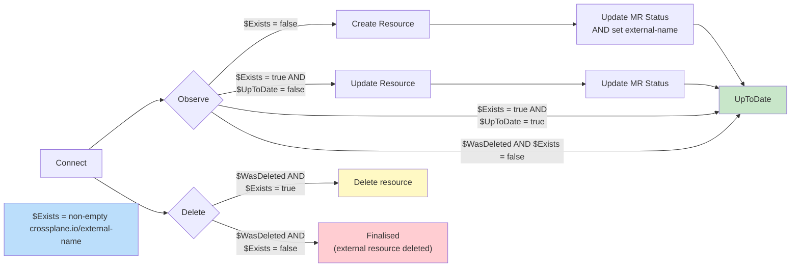

## Introduction

Kubernetes might be popular for its workload orchestration, but it really shines in how easily extendable it is via the controller pattern. Every time you install a CRD, you are essentially leveraging it. The problem is that it requires teams to create plenty of code to manage the lifecycle of a resource. Crossplane allows teams to write their own CRDs without having to write controllers (sort of).

This is possible via compositions and providers, where compositions are similar to Terraform modules and defined primarily using YAML (although some use Golang), and providers are essentially controllers for the Crossplane managed resources (similar to Terraform providers). They are responsible for managing the lifecycle of a specific object, such as “create, update and delete” a Bucket.

Most of the time you will either use an official provider or leverage upjet (generate from Terraform), but sometimes you will need to implement your own.

## Why create your own provider?

In most cases, you will be able to find an official provider (AWS/GCP) and, but sometimes you won't. There are two options: generate a provider using upjet or implement a provider yourself.

Upjet leverages the Terraform ecosystem and it generates providers that hook to it. In many cases this is enough, especially for well maintained Terraform providers. Many of the official Upbound and Crossplane providers use it and it is the quickest way to implement a custom provider. But, there are a few caveats:

1. Not all vendors will have a proper Terraform provider
2. Some Terraform providers might prove incompatible with Upjet
3. Teams might want to have custom logic between reconciliation logic (eg: emit specific metrics)
4. Upjet performance can be poor, resulting in delayed reconcile loops or OOMs

If you hit one of the above, you are left with implementing a provider from scratch. Before that, you must know how providers work.

## The Crossplane reconcile loop

Since Crossplane follows the controller pattern, a provider essentially implements the reconciliation loop, but with its own abstraction.

Instead of requiring a simple “reconcile” function, provider controllers must implement a strict interface with a few hooks, making it almost an “integration” framework. The lifecycle, order and state is managed by the Crossplane runtime, abstracting complexities that would generally need to be implemented using tools such as kubebuilder. Although, **I highly recommend engineers to go at least once through the managed reconciler controller,** since when troubleshooting something that will have most answers.

Besides the specific hooks in the reconcile loop, it leverages annotations to keep track of some of the reconciliation state. A very important one is [`crossplane.io/external-name`](http://crossplane.io/external-name): it keeps track of the underlying resource ID. If not set, the provider must set during its lifecycle (eg: on create), but the user might want to define it when applying the resource, [forcing an “import” on the first Observe loop](https://docs.crossplane.io/v2.3/guides/import-existing-resources/).

A provider lifecycle follows these steps:

1. **Setup:** only called when the provider starts up (once), not being part of the reconcile loop. In many cases though, it is where the API client will be set up, as sometimes it is not desirable to create a new client on every reconcile loop (eg: in Connect).
2. **Connect:** sets up client connections or anything required for the next steps of the reconciliation process. Different from `Setup`, this is done per-reconciliation loop and is paired with `Disconnect`.
3. **Observe:** fetches the resource from the third-party API and decides what to do next. It tries to fetch the resource via through the [`crossplane.io/external-name`](http://crossplane.io/external-name) resource annotation and then:
   1. If the annotation does not exist or the the vendor returns “not found”, it triggers `Create`
   2. If the resource exists but vendor response differs from the spec, it must trigger `Update`
   3. If the resource exists and vendor response matches the spec, it stores data in the resource status (this is essentially an “import”)
4. **Create:** creates it within the vendor and, once finished, it sets the external name in the managed resource object. Once the reconciliation kicks again, Observe will hydrate details to the object status.
5. **Update:** similar to create, but instead it calls update and does not change the external name
6. **Delete:** handles the resource deletion. If the resource still exists on the next reconciliation loop (when Observe gets triggered), it will still try to delete, ensuring no resource is left behind.
7. **Disconnect:** not always required, but in case you have resources that require clean up from the Connect stage, such as ephemeral database connections, this is the place (omitted in the diagram for simplicity).

## Anatomy of a provider repository

## Implementation

### Scaffolding

So you are ready to start implementing your custom provider? The Crossplane team maintains a [provider template](https://github.com/crossplane/provider-template), which is a good starting point for most. The README has most instructions on how to set it up and create your first controller (`provider.addType`).

Once you generate your type, you will get a `internal/controller/{}` which is what defines the aforementioned reconciliation hooks ([example](https://github.com/crossplane/provider-template/tree/main/internal/controller/mytype)).

### Setup

This function is called once on the provider setup and will mostly configure the `controller-runtime` for this specific resource. In general it is *“boilerplatey”*, but I suggest to add a few things here:

1. Inject the `controller.Options Logger` in the `connector` being created, since it is better to use the same logger used by the controller, with the same fields set by it
2. In case opening a connection to your vendor can be expensive / slow, you might want to implement and inject a connection pool map at this stage. An example is a provider that connects to databases and lazily starts a connection at `Connect`, adds to this pool, and re-uses across reconciles, instead of always terminating it at `Disconnect`. **Bear in mind this is in general an optimisation and not always required** since it adds extra complexity (eg: configuring connections timeouts).

### Connect / Disconnect

This is the first function called on the reconciliation loop ([example](https://github.com/crossplane/provider-template/blob/328a8a692f06a0306ffe7623463560fd3633a643/internal/controller/mytype/mytype.go#L120-L162)). Since all further hooks will need a client to be set up, **the provider must set it up at this stage and keep a reference in the generated `external` instance.**

The provider should read the `ProviderConfig` to wire up the auth and other bits for the client setup. Bear in mind that in Crossplane v2 this can be at cluster or namespace level.

One thing to note is that some SDKs / clients might require credential injection on every method call (eg: OpenAPI generated). Since they have HTTP Clients underneath, my recommendation is to create a custom HTTP Transport that sets the required auth headers, avoiding further boilerplate.

Paired with `Connect`, you must implement a `Disconnect` function to call `Close` on anything that needs closing. If you don't use some pool of lazily created connections, probably this is required and, if you don't implement it, congrats: you will have a memory leak.

| Repository | References |
| :--------- | :--------- |
| `crossplane-runtime` | [Connect/Disconnect core reference](https://github.com/crossplane/crossplane-runtime/blob/5092c39e4b0099816912dc7d07b2a670a0dba9dc/pkg/reconciler/managed/reconciler.go#L1145-L1176) |
| `provider-template` | [Code reference](https://github.com/crossplane/provider-template/blob/328a8a692f06a0306ffe7623463560fd3633a643/internal/controller/mytype/mytype.go#L120-L162) |

### Observe

This is one of the most important hooks since it defines what will (or not) be called next. It tries to fetch the resource via through the [`crossplane.io/external-name`](http://crossplane.io/external-name) resource annotation and then:

1. If the annotation does not exist, is empty or the the vendor returns “not found”, it triggers `Create` by returning `ResourceExists: false`
2. If it exists, it should always update the status of the MR (it is done via pointer when `cr.Status.AtProvider` is set) and the return must always have `ResourceExists: true`. The last part depends if the observed status matches the claim spec:
   1. If it matches, this is effectively an import and the it must return `ResourceUpToDate: true` and set it to available
   2. If does not, it must trigger an `Update` by returning `ResourceUpToDate: false`

| Repository | References |
| :--------- | :--------- |
| `crossplane-runtime` | [Update core reference](https://github.com/crossplane/crossplane-runtime/blob/5092c39e4b0099816912dc7d07b2a670a0dba9dc/pkg/reconciler/managed/reconciler.go#L1178-L1196) |
| `provider-template` | [Code reference](https://github.com/crossplane/provider-template/blob/328a8a692f06a0306ffe7623463560fd3633a643/internal/controller/mytype/mytype.go#L172-L218) |

### Create / Update

`Create` and `Update` are simple hooks: they receive a call from the controller, call either create/update within the third-party and update the `cr.Status.AtProvider` fields. The main difference between them is that `Create` must always set an `external-name` at the end of its call (ID on the third-party).

| Repository | References |
| :--------- | :--------- |
| `crossplane-runtime` | [Create core reference](https://github.com/crossplane/crossplane-runtime/blob/5092c39e4b0099816912dc7d07b2a670a0dba9dc/pkg/reconciler/managed/reconciler.go#L1349-L1471)   [Update core reference](https://github.com/crossplane/crossplane-runtime/blob/5092c39e4b0099816912dc7d07b2a670a0dba9dc/pkg/reconciler/managed/reconciler.go#L1515-L1571) |
| `provider-template` | [Code reference](https://github.com/crossplane/provider-template/blob/main/internal/controller/mytype/mytype.go#L220-L247) |

### Delete

A simple call to the third-party delete API. Once this is called, a subsequent reconcile will trigger `Observe`, which will not find the item and return `ResourceExists: false`. [Together with the `meta.WasDeleted() == true`](https://github.com/crossplane/crossplane-runtime/blob/5092c39e4b0099816912dc7d07b2a670a0dba9dc/pkg/reconciler/managed/reconciler.go#L1235-L1236), the runtime will conclude its deletion is finished. If for some reason though the delete did not work properly, it will keep retrying until the resource ceases to exist.

| Repository | References |
| :--------- | :--------- |
| `crossplane-runtime` | [Delete core reference](https://github.com/crossplane/crossplane-runtime/blob/5092c39e4b0099816912dc7d07b2a670a0dba9dc/pkg/reconciler/managed/reconciler.go#L1225-L1316) |
| `provider-template` | [Code reference](https://github.com/crossplane/provider-template/blob/328a8a692f06a0306ffe7623463560fd3633a643/internal/controller/mytype/mytype.go#L249-L255) |

###

## Async operations

All the above is okay if the API used is synchronous. For asynchronous APIs, the flow uses the same hooks, but acts differently. Mainly, once the provider creates or updates a resource, it will get an “operation id” and that should be stored as a status field, not as the external name.

On subsequent `Observe` calls, the provider can check the status of it against the provider and, once is deemed completed, it can return a `Resource{Exists|UpToDate}: true` and `LateInitialise: true` \+ update annotation such as the external name. The idea is that late initialisation allows setting fields after the object has been created.

\<TODO: probably add some examples why uptodate/exists must be set… can ask AI\>

| Repository | References |
| :--------- | :--------- |
| `crossplane-runtime` | [LateInitialise core reference](https://github.com/crossplane/crossplane-runtime/blob/5092c39e4b0099816912dc7d07b2a670a0dba9dc/pkg/reconciler/managed/reconciler.go#L1473-L1488) |

###

## Best practices

#### **Keep shared configuration in `ProviderConfig`**

Store connection-level details such as credentials, API endpoints, account or cluster identifiers, and default regions in `ProviderConfig`. This avoids repeating the same values across multiple resources and keeps your APIs cleaner. `spec.forProvider` should be for fields that represent the desired state of a resource resource (e.g. database name, size, or network). If multiple resources using the same credentials could have different values, it belongs in the resource spec — not the `ProviderConfig`.

#### **Use `crossplane.io/external-name` as the source of truth**

Always set the `external-name` annotation to the identifier used by the external system (e.g. ID, ARN, or resource path). This ensures your provider can reliably observe, update, and delete the resource. It also enables importing existing infrastructure by pre-populating the annotation. Avoid assuming the Kubernetes `metadata.name` matches the external name, since most of the time they won't.

#### **Avoid interacting with the Kubernetes API directly**

Your provider logic should focus on reconciling the external system, not managing Kubernetes objects. Crossplane’s managed reconciler already handles lifecycle concerns such as fetching resources, updating status, managing finalizers, and persisting annotations, all through pointers. Calling the Kubernetes API directly from your external client can lead to race conditions, conflicts, and harder-to-maintain code. Instead, return the appropriate observation or update results and let Crossplane handle the rest.

In case you need to do it, analyse if Crossplane doesn't provide some other abstraction to solve this. An example is secrets: most likely you should be relying on `ProviderConfig` secret references instead of implementing your own.

#### **Don't duplicate controllers unnecessarily**

Crossplane V2 allows cluster and namespaced resources. If you support both, avoid duplicating reconciliation logic. The external API interactions (observe, create, update, delete) are usually identical regardless of scope. Share this logic across controllers and only introduce separate implementations when there is a real difference in behavior or a compatibility requirement. This reduces maintenance overhead and keeps your provider easier to evolve and test.

## Ready to develop your first provider?

After all of that, I hope you are ready to develop your first provider. Feel free to have a look on [crossplane-demo](https://github.com/brunoluiz/crossplane-demo), which I have created for a [Container Days presentation on the topic](https://www.linkedin.com/feed/update/urn:li:activity:7428027963859755008/).

This document will be a live document and I will update it as I learn new things.
