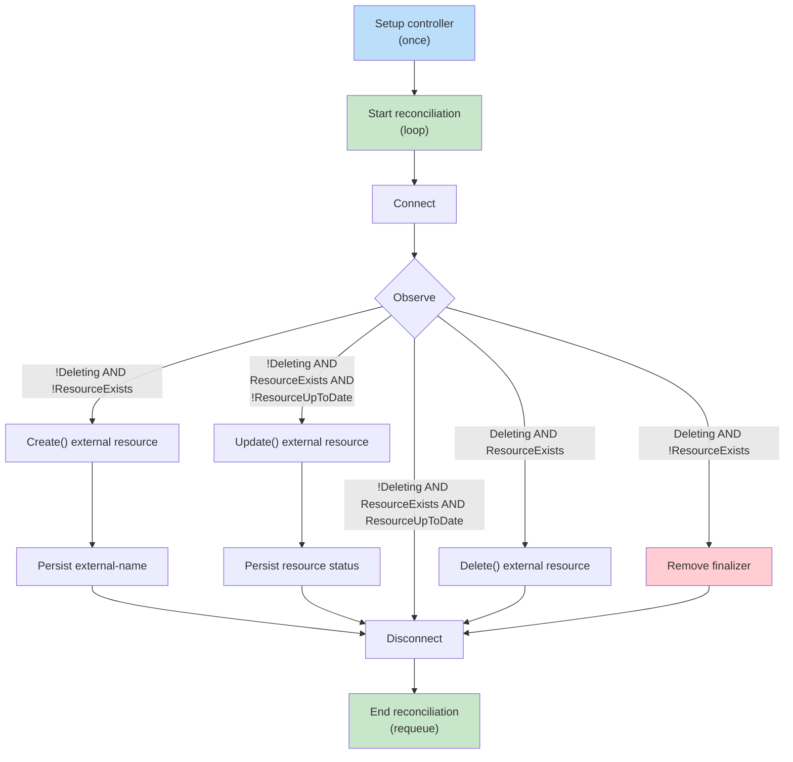

## Introduction

Crossplane allows you to define Kubernetes APIs without writing controllers. There are many components that enable it, such as compositions and XRDs, but providers are on the heart of it: they are controllers that handle the lifecycle of an external resource (e.g. a bucket), such as creating, updating, and deleting it.

Usually official providers or upjet generated ones are good enough, but sometimes you might come across issues. This is when you will need to implement your own, which we will cover in this post.

## Why create your own provider?

Sometimes you will be able to find an official provider (AWS/GCP) that is decent and well maintained, but other times you won't since Crossplane still does not have as much coverage as Terraform. Hence, there are two options: generate a provider using [upjet](https://github.com/crossplane/upjet) or implement a provider yourself.

[Upjet](https://github.com/crossplane/upjet) leverages the Terraform ecosystem and it generates providers that hook to its providers. In many cases this is enough, especially for well maintained Terraform providers. Many of the official Upbound and Crossplane providers use it and it is the quickest way to implement a custom provider. But, there are a few caveats:

1. Not all vendors will have a proper Terraform provider, if they have one at all
2. Some Terraform providers might be incompatible with Upjet
3. Teams might want to have custom logic between reconciliation logic (e.g. emit specific metrics)
4. Generated providers can be slow or memory-intensive when Terraform overhead is a poor fit

If you hit one of the above, you are left with implementing a provider from scratch.

## Start with the provider template

Don't panic: you won't start fully from scratch. The Crossplane team maintains a [provider template](https://github.com/crossplane/provider-template), which is a good starting point for most providers and also they maintain very popular providers ([provider-http](https://github.com/crossplane-contrib/provider-http) and [provider-opentofu](https://github.com/upbound/provider-opentofu)) you can base yourself on.

The template gives you the repository structure, build tooling and scaffolding utilities (e.g. `make provider.addtype`). All generated types will be placed in `internal/controller/{}` and those will define the reconciliation hooks described in the next section ([example](https://github.com/crossplane/provider-template/tree/main/internal/controller/mytype)). The provider's behaviour comes from how those hooks interact with the external API.

## Implementing the Crossplane reconcile loop

<small>ℹ️ The following assumes that [default management policies](https://github.com/crossplane/crossplane-runtime/blob/5092c39e4b0099816912dc7d07b2a670a0dba9dc/pkg/reconciler/managed/api.go#L48-L61) are in place, as otherwise they change the lifecycle behaviour.</small>

Crossplane providers use the controller pattern through a managed reconciler abstraction. Instead of a single `Reconcile` function, provider controllers implement a strict interface with several hooks. The Crossplane runtime manages their lifecycle, ordering, and state, handling work that a controller built with Kubebuilder would otherwise need to implement (and probably lose some hair when bugs end up surfacing).

### Lifecycle hooks in a nutshell

`Setup` runs once to register the controller for a "managed-resource" kind, but it is not part of the reconciliation loop. After it is all setup, the controller runtime will start reconciling and each time it will call `Connect`, `Observe`, and then `Create`, `Update`, or `Delete` when needed before calling `Disconnect`.

Besides these specific hooks in the reconcile loop, Crossplane leverages annotations to keep track of reconciliation state. The most important one is [`crossplane.io/external-name`](https://docs.crossplane.io/v2.3/managed-resources/managed-resources/#naming-external-resources), which identifies the underlying resource via a stable lookup key (e.g. ID, ARN, or resource path):

- Before `Connect` and `Observe`, the [managed reconciler's default initializer](https://github.com/crossplane/crossplane-runtime/blob/5092c39e4b0099816912dc7d07b2a670a0dba9dc/pkg/reconciler/managed/api.go#L48-L61) persists `metadata.name` as the external name when the annotation is absent. Providers overwrite it during `Create` only when the external system returns a different stable lookup key.
- Users can pre-populate it to identify and import an existing resource, although it should be used together with an `Observe` management policy to prevent unintended changes ([docs about Crossplane resource import](https://docs.crossplane.io/v2.3/guides/import-existing-resources/)).

If [management policies are set to `*` (the default)](https://docs.crossplane.io/v2.3/managed-resources/managed-resources/#managementpolicies), so that no hook is excluded, the provider lifecycle can be summarised as:



The only way I fully grasped the above was after I gone through the [crossplane-runtime managed reconciler code](https://github.com/crossplane/crossplane-runtime/blob/5092c39e4b0099816912dc7d07b2a670a0dba9dc/pkg/reconciler/managed/reconciler.go#L919-L1572) while implementing a provider. I suggest going through it at least once, since most of the heavy lifting is done there and is useful to know how it behaves and how it calls the described hooks.

### Setup: registers controller dependencies

This hook runs once during provider setup and configures `controller-runtime` for the resource. It is also the right place to add a few shared dependencies:

1. Inject the `controller.Options Logger` in the `connector` being created, since it is better to use the same logger used by the controller, with the same fields set by it
2. In case opening a connection to your vendor can be expensive / slow, you might want to implement and inject a connection pool map at this stage. An example is a provider that connects to databases and lazily starts a connection at `Connect`, adds to this pool, and re-uses across reconciles, instead of always terminating it at `Disconnect`. **Bear in mind this is in general an optimisation and not always required** since it adds extra complexity (e.g. configuring connections timeouts).

Once the setup is finished, the controller runtime will only call the other hooks related to the reconciliation.

```go
func Setup(mgr ctrl.Manager, o controller.Options) error {
	name := managed.ControllerName(v1alpha1.UserGroupKind)
  // Sets up the connector which will define how to handle and initialise
  // the external resource lifecycle (eg: via an external API client)
	connector := &connector{
		kube:  mgr.GetClient(),
		usage: resource.NewProviderConfigUsageTracker(
			mgr.GetClient(), &apisv1alpha1.ProviderConfigUsage{},
		),
	}

  // Creates the managed reconciler for the specified CRD Kind, pointing
  // to the specific connector. It allows also many features/opts to be set.
	r := managed.NewReconciler(mgr,
		resource.ManagedKind(v1alpha1.UserGroupVersionKind),
		managed.WithExternalConnector(connector),
		managed.WithLogger(o.Logger.WithValues("controller", name)),
	)

  // ... Other settings and flags

	return ctrl.NewControllerManagedBy(mgr).Named(name).
		WithOptions(o.ForControllerRuntime()).
		WithEventFilter(resource.DesiredStateChanged()).
		For(&v1alpha1.User{}).
		Complete(r)
}
```

| Repository | References |
| :--------- | :--------- |
| `provider-template` | [Setup and reconciler wiring](https://github.com/crossplane/provider-template/blob/328a8a692f06a0306ffe7623463560fd3633a643/internal/controller/mytype/mytype.go#L58-L110) |
| `crossplane-demo/provider-acme` | [Setup and reconciler wiring](https://github.com/brunoluiz/crossplane-demo/blob/cad548528c58e407430d6e0e23b128c45403bf70/provider-acme/internal/controller/user/user.go#L38-L59) |

### Connect: create your clients

This is the first hook called on the Crossplane reconciliation loop. Since all further hooks need a client, **the provider must set it up here and keep a reference in the
generated `external` instance.**

- The provider should read `ProviderConfig` to configure authentication and other client settings. In Crossplane v2, it can be cluster or namespace-scoped, so be aware you might need logic to read the correct one.
- Clients most likely will require credentials on method calls. A custom middleware (e.g. HTTP Transport, gRPC interceptor) can set the required authorisation details and avoid duplicating that work at each call site, requiring only injecting those.

```go
func (c *connector) Connect(
	ctx context.Context,
	mg resource.Managed,
) (managed.ExternalClient, error) {
	cr := mg.(*v1alpha1.User)
	if err := c.usage.Track(ctx, cr); err != nil {
		return nil, fmt.Errorf("track ProviderConfig usage: %w", err)
	}

	// Read either ProviderConfig or ClusterProviderConfig, then resolve both
	// SecretKeySelectors independently before creating the vendor client.
	baseURL, username, password, err := c.providerConfig(ctx, cr)
	if err != nil {
		return nil, fmt.Errorf("create client during connect: %w", err)
	}

	return &external{
		client: acme.NewClient(baseURL, username, password),
	}, nil
}
```

Paired with `Connect`, implement `Disconnect` to close resources that need closing. It can be a no-op for reusable clients such as `http.Client`, but might be required in cases of database connections (depending on how they are managed).

```go
func (c *external) Disconnect(context.Context) error { return nil }
```

| Repository | References |
| :--------- | :--------- |
| `crossplane-runtime` | [Connect/Disconnect core reference](https://github.com/crossplane/crossplane-runtime/blob/5092c39e4b0099816912dc7d07b2a670a0dba9dc/pkg/reconciler/managed/reconciler.go#L1145-L1176) |
| `provider-template` | [Code reference](https://github.com/crossplane/provider-template/blob/328a8a692f06a0306ffe7623463560fd3633a643/internal/controller/mytype/mytype.go#L120-L162) |
| `crossplane-demo/provider-acme` | [Connect and Disconnect](https://github.com/brunoluiz/crossplane-demo/blob/cad548528c58e407430d6e0e23b128c45403bf70/provider-acme/internal/controller/user/user.go#L61-L115) |

### Observe: the provider's "brain"

This is one of the most important hooks since it defines what will (or not) be called next. It fetches the resource through the `crossplane.io/external-name` annotation and then:

1. The default managed reconciler initialises the annotation from `metadata.name`, so `Observe` normally queries the vendor with a non-empty external name. A vendor “not found” response triggers `Create` by returning `ResourceExists: false`.
2. If it exists, it should always update the status of the MR (it is done via pointer when `cr.Status.AtProvider` is set) and the return must always have `ResourceExists: true`. The provider can mark it available after a successful lookup. It should return `ResourceUpToDate: true` when the vendor observed object match `spec.forProvider`, otherwise `Update` is triggered (drift).

The example below assumes the vendor adapter exposes user-specific CRUD methods and that it returns a typed `ErrNotFound`.

```go
func (c *external) Observe(
	ctx context.Context,
	mg resource.Managed,
) (managed.ExternalObservation, error) {
	cr := mg.(*v1alpha1.User)
	observed, err := c.client.GetUser(ctx, meta.GetExternalName(cr))
	if errors.Is(err, acme.ErrNotFound) {
		return managed.ExternalObservation{ResourceExists: false}, nil
	}
	if err != nil {
		return managed.ExternalObservation{}, fmt.Errorf("get user: %w", err)
	}

	// A successful lookup means the external resource is available.
	// Extract this to updateStatus once it spans several fields.
	cr.Status.AtProvider.ID = observed.ID
	cr.Status.AtProvider.Name = observed.Name
	cr.Status.AtProvider.Email = observed.Email
	cr.Status.SetConditions(xpv1.Available())

	// Extract this to isUpToDate when several fields must be compared.
	upToDate := cr.Spec.ForProvider.Name == observed.Name &&
		cr.Spec.ForProvider.Email == observed.Email

	return managed.ExternalObservation{
		ResourceExists:   true,
		ResourceUpToDate: upToDate,
	}, nil
}
```

| Repository | References |
| :--------- | :--------- |
| `crossplane-runtime` | [Update core reference](https://github.com/crossplane/crossplane-runtime/blob/5092c39e4b0099816912dc7d07b2a670a0dba9dc/pkg/reconciler/managed/reconciler.go#L1178-L1196) |
| `provider-template` | [Code reference](https://github.com/crossplane/provider-template/blob/328a8a692f06a0306ffe7623463560fd3633a643/internal/controller/mytype/mytype.go#L172-L218) |
| `crossplane-demo/provider-acme` | [Observe](https://github.com/brunoluiz/crossplane-demo/blob/cad548528c58e407430d6e0e23b128c45403bf70/provider-acme/internal/controller/user/user.go#L135-L157) |

### Create: resource creation and `external-name` setting

`Create` is called after `Observe` returns `ResourceExists: false`. It creates the resource in the external system and sets `external-name` if it assigns a stable identifier (e.g. ID). Crossplane's managed reconciler persists the annotation changes made in this hook, but discards status changes. The status gets hydrated during the next `Observe` instead.

```go
func (c *external) Create(
	ctx context.Context,
	mg resource.Managed,
) (managed.ExternalCreation, error) {
	cr := mg.(*v1alpha1.User)
	created, err := c.client.CreateUser(ctx, acme.User{
		Name:  cr.Spec.ForProvider.Name,
		Email: cr.Spec.ForProvider.Email,
	})
	if err != nil {
		return managed.ExternalCreation{}, fmt.Errorf("create user: %w", err)
	}

	// Create persists annotations, but not status. Observe hydrates status.
	meta.SetExternalName(cr, created.ID)
	return managed.ExternalCreation{}, nil
}
```

| Repository | References |
| :--------- | :--------- |
| `crossplane-runtime` | [Create core reference](https://github.com/crossplane/crossplane-runtime/blob/5092c39e4b0099816912dc7d07b2a670a0dba9dc/pkg/reconciler/managed/reconciler.go#L1349-L1471) |
| `provider-template` | [Code reference](https://github.com/crossplane/provider-template/blob/main/internal/controller/mytype/mytype.go#L220-L230) |
| `crossplane-demo/provider-acme` | [Create](https://github.com/brunoluiz/crossplane-demo/blob/cad548528c58e407430d6e0e23b128c45403bf70/provider-acme/internal/controller/user/user.go#L159-L176) |

### Update: resource update and status refresh

`Update` is called after `Observe` returns `ResourceExists: true` and `ResourceUpToDate: false`. It changes the external resource to match `spec.forProvider`. Unlike `Create`, the reconciler persists status changes made by `Update`, so it can refresh `cr.Status.AtProvider` and conditions, but no annotations mutation is persisted here. A subsequent `Observe` should confirm that the resource is now up to date.

```go
func (c *external) Update(
	ctx context.Context,
	mg resource.Managed,
) (managed.ExternalUpdate, error) {
	cr := mg.(*v1alpha1.User)
	updated, err := c.client.UpdateUser(ctx, meta.GetExternalName(cr), acme.User{
		Name:  cr.Spec.ForProvider.Name,
		Email: cr.Spec.ForProvider.Email,
	})
	if err != nil {
		return managed.ExternalUpdate{}, fmt.Errorf("update user: %w", err)
	}

	// Update persists status, unlike Create, so refresh the observed fields.
	cr.Status.AtProvider.ID = updated.ID
	cr.Status.AtProvider.Name = updated.Name
	cr.Status.AtProvider.Email = updated.Email
	return managed.ExternalUpdate{}, nil
}
```

| Repository | References |
| :--------- | :--------- |
| `crossplane-runtime` | [Update core reference](https://github.com/crossplane/crossplane-runtime/blob/5092c39e4b0099816912dc7d07b2a670a0dba9dc/pkg/reconciler/managed/reconciler.go#L1515-L1571) |
| `provider-template` | [Code reference](https://github.com/crossplane/provider-template/blob/main/internal/controller/mytype/mytype.go#L232-L247) |
| `crossplane-demo/provider-acme` | [Update](https://github.com/brunoluiz/crossplane-demo/blob/cad548528c58e407430d6e0e23b128c45403bf70/provider-acme/internal/controller/user/user.go#L178-L195) |

### Delete: ensuring resource is gone

`Delete` calls the external delete API after `Observe` reports that a deleting managed resource still exists externally. On a later reconciliation, `Observe` reports `ResourceExists: false` and, together with [`meta.WasDeleted() == true`](https://github.com/crossplane/crossplane-runtime/blob/5092c39e4b0099816912dc7d07b2a670a0dba9dc/pkg/reconciler/managed/reconciler.go#L1235-L1236), the runtime removes its finaliser. If the external resource remains, it keeps retrying deletion until the resource ceases to exist.

```go
func (c *external) Delete(
	ctx context.Context,
	mg resource.Managed,
) (managed.ExternalDelete, error) {
	cr := mg.(*v1alpha1.User)
	err := c.client.DeleteUser(ctx, meta.GetExternalName(cr))
	if errors.Is(err, acme.ErrNotFound) {
		return managed.ExternalDelete{}, nil
	}
	if err != nil {
		return managed.ExternalDelete{}, fmt.Errorf("delete user: %w", err)
	}

	return managed.ExternalDelete{}, nil
}
```

| Repository | References |
| :--------- | :--------- |
| `crossplane-runtime` | [Delete core reference](https://github.com/crossplane/crossplane-runtime/blob/5092c39e4b0099816912dc7d07b2a670a0dba9dc/pkg/reconciler/managed/reconciler.go#L1225-L1316) |
| `provider-template` | [Code reference](https://github.com/crossplane/provider-template/blob/328a8a692f06a0306ffe7623463560fd3633a643/internal/controller/mytype/mytype.go#L249-L255) |
| `crossplane-demo/provider-acme` | [Delete](https://github.com/brunoluiz/crossplane-demo/blob/cad548528c58e407430d6e0e23b128c45403bf70/provider-acme/internal/controller/user/user.go#L197-L212) |


## Best practices learned the hard way

### Classify vendor errors before returning an observation

In the adapter/client layer, not found errors must always be mapped differently than other errors when returning (eg: `ErrNotFound` x `ErrInternal`). This will enable the controller to return `ResourceExists: false` correctly when an error is returned on `Observe`. Not handling this properly can make Crossplane create resource duplicates.

### Use vendor idempotency mechanisms when creating resources

Network failures or pod crashes can leave a provider unable to tell whether a create request succeeded. When the vendor supports idempotency keys, send a stable key with the request so a retry cannot create a duplicate resource. If idempotency is not supported, you can still try to lookup by a deterministic name / key before issuing another create request. Bear in mind that not all vendors support these mechanisms.

### Let Crossplane persist state and minimise Kube client calls

Your external client logic should focus on reconciling the external system, not persisting changes to the managed resource. Crossplane’s managed reconciler already handles lifecycle concerns such as updating status, managing finalizers, and persisting annotations. Calling the Kubernetes API to mutate the managed resource from an external client can lead to race conditions, conflicts, and harder-to-maintain code. Instead, return the appropriate observation or update results and let Crossplane handle the rest.

Using the Kubernetes client in `Connect` to read the referenced `ProviderConfig` and credentials Secret is expected. When you need other Kubernetes resources, first check whether Crossplane provides an abstraction. For example, use `ProviderConfig` secret references for credentials rather than defining a separate secret-management mechanism.

### Share logic between namespaced and cluster-scoped resources

Crossplane V2 allows cluster and namespaced resources. If you support both, avoid duplicating reconciliation logic. The external API interactions (observe, create, update, delete) are usually identical regardless of scope. Share this logic across controllers and only introduce separate implementations when there is a real difference in behaviour or a compatibility requirement. This reduces maintenance overhead and keeps your provider easier to evolve and test.


### Put connection defaults in `ProviderConfig`

Store connection-level details such as credentials, API endpoints, account or cluster identifiers, and default regions in `ProviderConfig`. This avoids repeating the same values across multiple resources and keeps your APIs cleaner. `spec.forProvider` should be for fields that represent the desired state of a resource (e.g. database name, size, or network), not for connection URLs or similar. An example could be

```yaml
# You don't need to pass database and host or any other information to MRs
# Instead, they can just infer from the ProviderConfig
---
apiVersion: postgres.acme.io/v1alpha1
kind: ProviderConfig
metadata:
  name: users
spec:
  host: "users.default"
  database: users
  credentials:
    user:
      name: pg-users-auth
      key: user
    password:
      name: pg-users-auth
      key: password
---
apiVersion: postgres.acme.io/v1alpha1
kind: ProviderConfig
metadata:
  name: billing
spec:
  host: "billing.default:5432"
  databse: billing
  credentials:
    user:
      name: pg-billing-auth
      key: user
    password:
      name: pg-billing-auth
      key: password
```

## Start building a provider

Hopefully you now have a good understanding of how providers work and are implemented. Understanding the state machine that is the managed resource reconciler will give you a real edge when implementing and troubleshooting providers.

Bear in mind that that although this is a long post, there are certainly flows I have not covered and others that I have not come across yet. It really comes down to trying things out and discovering along the way. I will update this blog post if I find out more best practices or anything of note around the general flow.

To start your own provider, I suggest cloning the [Crossplane provider template](https://github.com/crossplane/provider-template), and leverage [provider-opentofu](https://github.com/upbound/provider-opentofu), [provider-http](https://github.com/crossplane-contrib/provider-http) and my [provider-acme](https://github.com/brunoluiz/crossplane-demo/tree/main/provider-acme) for a working reference. It is daunting at first, especially with the considerable amount of boilerplate, but eventually the reconciler flow settles and most of your focus will go towards API design and integration, feeling almost like any other API or controller implementation.
